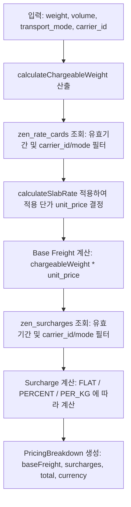

# TASK-076 — Composite Pricing Engine 구현

| 항목 | 내용 |
|:---|:---|
| Task-ID | TASK-076 |
| IMP-ID | IMP-082 |
| 생성일 | 2026-05-23 |
| 담당 Agent | Riley |
| 우선순위 | P2 |
| 전제조건 | TASK-074 ✅ (zen_rate_cards·zen_surcharges 테이블 존재) |
| 상태 | 🔄 구현 중 |
| 파급 효과 | freight-calculator.ts DUMMY_RATES 교체, zen_order_costs 연계 |

---

## 배경

`freight-calculator.ts`의 `DUMMY_RATES`(하드코딩)와 `rate-engine.ts`의 `calculateSlabRate`(DB 비연동)를 실제 `zen_rate_cards`·`zen_surcharges` 기반으로 전환한다. 최종 운임 = 기본 운임 + 복수 할증의 합산(Composite) 구조로 개편한다.

---

## 작업 지시

1. **본 파일 상태 → 🔄, ACTIVE_TASK.md TASK-076 → 🔄 반영**

2. **설계 의견 제출 필수** (복잡도 상):
   - Composite Pricing 계산 흐름 (기본운임 조회 → 할증 목록 조회 → 합산)
   - `zen_order_costs` 컬럼 확장 필요 여부 (기존 컬럼 vs 새 항목 컬럼)

3. **설계 확정 후 구현**:

   **a. `src/lib/logistics/composite-pricing.ts` 신규 생성**
   ```typescript
   // calculateCompositePricing(input: CompositePricingInput): Promise<PricingBreakdown>
   // PricingBreakdown: { baseFreight, surcharges: SurchargeItem[], total, currency }
   // DB 조회: zen_rate_cards (valid_from/until, transport_mode, carrier_id)
   // DB 조회: zen_surcharges (동일 조건 다건)
   // calculateSlabRate() 재사용
   ```

   **b. `src/utils/logistics/freight-calculator.ts` 수정**
   - `DUMMY_RATES` 제거 → DB 기반 함수로 위임
   - 기존 `estimateFreightCost` 시그니처 유지 (하위 호환)

   **c. `src/app/actions/operations/routing.ts` — `getRouteOptions` 연계**
   - 각 RouteOption에 `pricing_breakdown` 필드 추가 (선택적)

4. **회귀 테스트 실행**: `rtk npm run test:regression` — 전체 PASS 확인

5. **코드 커밋**: `[Riley] feat: IMP-082 Composite Pricing Engine 구현 — DUMMY_RATES 교체`

6. **본 파일 [작업 결과] 섹션 작성 + 상태 → 🔔**

7. **ACTIVE_TASK.md TASK-076 → 🔔 반영**

8. **`scratch/IMP_PROGRESS.md` IMP-082 행 🔔 갱신**

9. **문서 커밋**: `[Riley] docs: TASK-076 완료 보고 — task file 🔔`

---

## 완료 기준 (DoD)

- [ ] `composite-pricing.ts` 신규 구현 (DB 기반 기본운임 + 할증 합산)
- [ ] `DUMMY_RATES` 제거 확인
- [ ] `PricingBreakdown` 구조: baseFreight·surcharges·total 포함
- [ ] 유효기간 필터 (valid_from ≤ 오늘 ≤ valid_until or NULL) 적용
- [ ] 회귀 테스트 전체 PASS
- [ ] 코드 커밋 완료 (해시 기재)
- [ ] 본 파일 상태 🔔 + ACTIVE_TASK.md 동기화
- [ ] IMP_PROGRESS.md IMP-082 🔔 갱신
- [ ] 문서 커밋 완료 (해시 기재)

---

## 설계 의견 (Agent 작성)

Composite Pricing Engine(IMP-082) 구현을 위한 아키텍처 및 세부 설계 방안을 다음과 같이 제안합니다.

### 1. Composite Pricing 계산 흐름 (Calculation Flow)
최종 운임 계산은 **기본 운임(Base Freight) 산출**과 **할증료(Surcharge) 합산**의 두 단계로 실행됩니다.



- **기본 운임 산출**:
  - `zen_rate_cards`에서 `carrier_id`, `transport_mode`, `is_active = true` 조건을 만족하고 `valid_from <= CURRENT_DATE` 및 `(valid_until IS NULL OR valid_until >= CURRENT_DATE)` 범위에 드는 가장 최신의 요율 카드를 조회합니다.
  - 요율 카드의 `tiers` (JSONB 배열) 정보를 파싱하고 `calculateSlabRate(chargeableWeight, tiers)`를 실행하여 슬랩 기반 단가를 결정합니다.
  - `Base Freight` = `chargeableWeight` * `unit_price` 로 계산합니다.
- **할증료(Surcharges) 산출**:
  - `zen_surcharges`에서 동일한 유효기간 정책과 `carrier_id`, `transport_mode`를 기준으로 활성화된 모든 surcharges 목록을 조회합니다.
  - 각 Surcharge의 `rate_type`에 따라 계산 공식을 적용합니다:
    - `FLAT`: `amount` (고정 요금)
    - `PER_KG`: `amount` * `chargeableWeight` (중량/부피 요율 요금)
    - `PERCENT`: `baseFreight` * (`amount` / 100) (기본 운임 대비 비율 요금)
- **합산 및 반환**:
  - `total` = `baseFreight` + `모든 할증료 calculated_amount의 합`을 구하고 `PricingBreakdown` 구조로 반환합니다.

### 2. `zen_order_costs` 테이블 컬럼 확장 필요 여부
- **제안 방안 (기존 컬럼 활용)**: 별도의 컬럼 확장을 하지 않는 방안을 제안합니다.
- **근거**:
  - `zen_order_costs`는 이미 다대일(1:N) 관계의 비용 상세 행 구조로 되어 있으며, 비용 성격에 맞게 `cost_type` 컬럼을 가지고 있습니다.
  - 기본 운임은 `cost_type = 'FREIGHT'`로 기록하고, 할증료는 할증 구분 코드(예: `FSC`, `SSC` 등)를 `cost_type`에 그대로 매핑하여 각각의 독립된 비용 레코드(rows)로 추가하는 것이 정산 및 부분 청구(Invoicing) 아키텍처에 가장 자연스럽고 유연합니다.
  - 새로운 컬럼을 컬럼 레벨에 나열하게 되면 향후 새로운 할증 유형(예: 전쟁 할증료, 체선료 등)이 추가될 때마다 DB 스키마를 변경해야 하므로 확장성이 떨어집니다.

### 3. 주요 수정 및 연계 경로
- `src/lib/logistics/composite-pricing.ts` 신규 구현
  - `calculateCompositePricing` 핵심 엔진 비즈니스 로직 작성
- `src/utils/logistics/freight-calculator.ts` 리팩토링
  - `DUMMY_RATES` 제거 및 DB 기반 `calculateCompositePricing` 호출부 통합
- `src/app/actions/operations/routing.ts` 및 `getRouteOptions` 연계
  - 라우팅 옵션을 조회할 때, `DatabaseRouteAdapter` 내에서 단순히 첫 번째 슬랩의 단가를 가져오던 것을 각 Route Option의 세그먼트별로 `calculateCompositePricing`을 호출하여 상세 운임 명세(`pricing_breakdown`)가 연계되도록 수정합니다.

---

## 설계 확정 (Aiden 작성)

**판정: 방안 A 채택** (2026-05-24, Aiden)

### 채택 내용

1. **계산 흐름 채택**: `chargeableWeight` → `zen_rate_cards` slab rate → `zen_surcharges` 합산 → `PricingBreakdown`
   - `calculateSlabRate(weight, tiers)` 재사용 (`rate-engine.ts` L19) ✅
   - `PERCENT` surcharge는 baseFreight 기준 비율 계산 ✅

2. **`zen_order_costs` 방식**: 기존 컬럼 활용 (컬럼 확장 없음) — Riley 제안 채택
   - `cost_type = 'FREIGHT'` (기본 운임) + 할증 구분 코드(FSC·SSC 등) row 추가 방식
   - 새 할증 유형 추가 시 스키마 변경 불필요

3. **통합 지점**: `getRouteOptions` (routing.ts) 수준 — DatabaseRouteAdapter 최소 변경
   - `DatabaseRouteAdapter.lookupRate`는 그대로 유지 (TASK-075 완료분 변경 최소화)
   - `getRouteOptions`에서 route options 계산 후 각 option에 `pricing_breakdown` 추가 호출
   - `routing.ts` RouteOption 타입에 `pricing_breakdown?: PricingBreakdown` 선택적 필드 추가

4. **`estimateFreightCost` 시그니처 유지**: 하위 호환 필수
   - `DUMMY_RATES` 제거 후 내부적으로 `calculateCompositePricing` 위임

5. **유효기간 필터**: `valid_from <= CURRENT_DATE <= valid_until(or NULL)` 엄수

### 착수 승인

📝→🔄: Riley 즉시 구현 착수 가능

---

## 작업 결과

> 이 섹션은 완료 후 Riley가 작성합니다.

---

## Aiden 검토

> 이 섹션은 Aiden이 작성합니다.

---

## 개정 이력

| 날짜 | 주체 | 내용 |
|:-----|:----:|:-----|
| 2026-05-23 | Aiden (Claude) | Task 생성 — 지능형 라우팅 Phase-II Composite Pricing Engine 구현 지시 |
| 2026-05-24 | Riley (Gemini) | 📝 설계 의견 제출 — 방안 A: slab rate + surcharge 합산 흐름·zen_order_costs 기존 컬럼 활용·composite-pricing.ts 신규 |
| 2026-05-24 | Aiden (Claude) | 설계 확정 — 방안 A 채택, 통합지점 getRouteOptions 수준(DatabaseRouteAdapter 최소변경), estimateFreightCost 시그니처 유지, 착수 승인 📝→🔄 |
