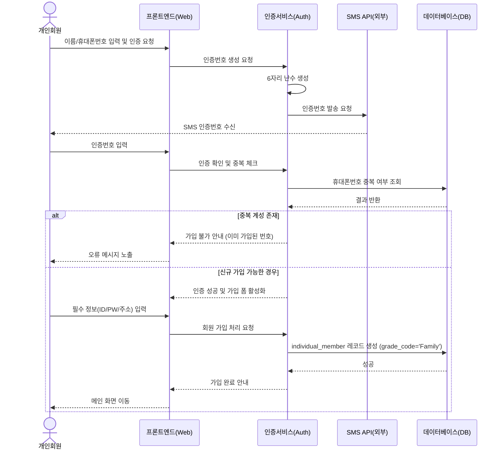
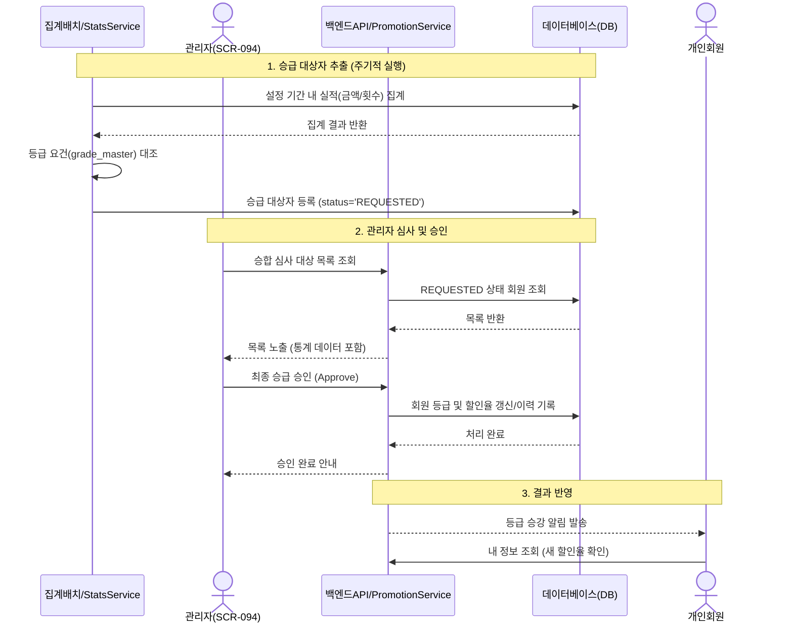
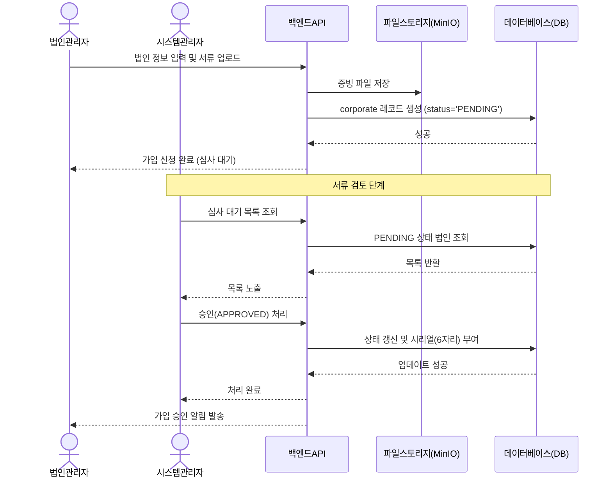
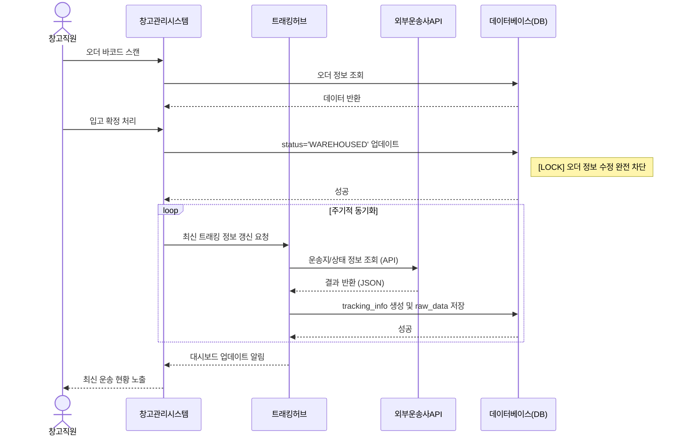
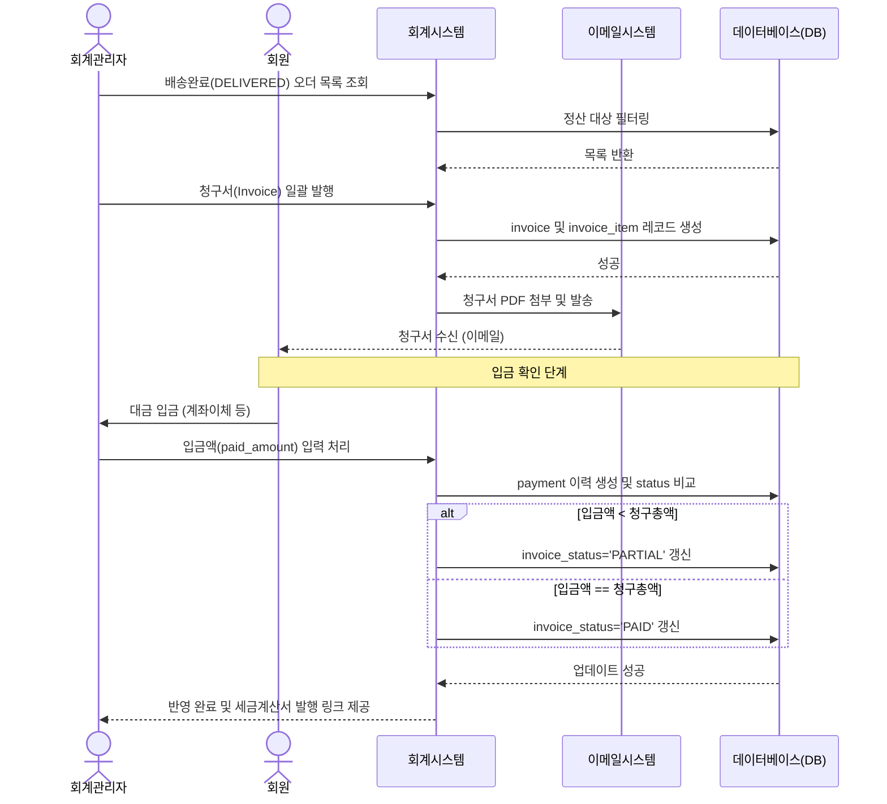

# 마. 시퀀스 다이어그램 (An_05_Sequence_Diagram)

> **프로젝트:** ZENITH_LMS (SNTL 통합 물류 플랫폼)
> **문서번호:** An-05
> **작성자:** Antigravity (AI Agent)
> **작성일:** 2026-04-16
> **버전:** v1.1
> **최종 수정일:** 2026-04-17

## 📚 참고 문서 (Related Documents)
시퀀스 다이어그램의 데이터 구조 및 비즈니스 로직에 대한 상세 내용은 아래 문서를 참조하십시오.
- [An_01_데이터사전](file:///Users/edward.kwon/WorkSpace/ZENITH_LMS_001/docs/02_Analysis/An_01_데이터사전.md)
- [An_02_업무흐름정의](file:///Users/edward.kwon/WorkSpace/ZENITH_LMS_001/docs/02_Analysis/An_02_업무흐름정의.md)
- [An_03_코드정의](file:///Users/edward.kwon/WorkSpace/ZENITH_LMS_001/docs/02_Analysis/An_03_코드정의.md)
- [Fun_Detail_02_회원관리](file:///Users/edward.kwon/WorkSpace/ZENITH_LMS_001/docs/02_Analysis/Fun_Detail_02_회원관리.md)
- [Fun_Detail_07_회계_청구](file:///Users/edward.kwon/WorkSpace/ZENITH_LMS_001/docs/02_Analysis/Fun_Detail_07_회계_청구.md)

---

본 문서는 ZENITH_LMS의 핵심 업무 흐름을 시각화하여 객체 간의 상호작용과 데이터 흐름을 정의합니다.

## 1. 회원 및 인증 모듈

### 1.1 개인회원 가입 및 본인인증
개인 사용자가 SMS 인증을 통해 계정을 생성하는 흐름입니다.



### 1.3 개인회원 등급 승급 프로세스 [신규]
이용 실적에 따라 등급을 산정하고 관리자 승인을 거쳐 혜택을 부여하는 절차입니다.


```

### 1.2 법인 심사 및 승인 프로세스
법인관리자의 가입 신청부터 관리자의 최종 승인까지의 흐름입니다.



## 2. 오더 및 운송 모듈

### 2.1 오더 등록 및 마스터오더 패킹 (Locking 지점)
하우스 오더 생성 단계부터 패킹을 통한 수정 제약 발생 시점까지의 흐름입니다.

```mermaid
sequenceDiagram
    actor Member as 회원
    actor Op as 운영자
    participant Order as 오더관리서스
    participant Calc as 운임계산엔진
    participant DB as 데이터베이스(DB)

    Member->>Order: 오더 정보 입력 (송수하인/화물)
    Order->>Calc: 예상 운송비 산출 요청
    Calc->>DB: 원가 및 회원 할인율 조회
    DB-->>Calc: 데이터 반환
    Calc->>Calc: 판매가 계산 (원가+이익-할인)
    Calc-->>Order: 예상 운임 반환
    Order-->>Member: 가격 노출 및 확정 버튼 활성화
    
    Member->>Order: 오더 등록 확정
    Order->>DB: orders 레코드 생성 (status='REGISTERED')
    DB-->>Order: 성공 (order_no 발급)
    
    Note over Op, DB: 마스터오더 구성 (Packing)
    Op->>Order: 미패킹 오더 목록 조회
    Order->>DB: REGISTERED 오더 필터링
    DB-->>Order: 목록 반환
    
    Op->>Order: 오더 선택 및 Packing 수행
    Order->>DB: master_order 생성 및 관련 오더 status='PACKED' 갱신
    Note right of DB: [LOCK] 이후 하우스오더 수정 불가
    DB-->>Order: 성공

### 2.2 이기종 데이터 표준화 매핑 프로세스 [신규]
외부 기관(항공사, 정부 등)으로부터 수신된 상이한 코드를 내부 표준으로 변환하는 흐름입니다.

```mermaid
sequenceDiagram
    participant Ext as 외부시스템/파일
    participant Int as 인터페이스서비스
    participant Map as MappingService
    participant DB as 데이터베이스(DB)

    Ext->>Int: 원천 데이터 수신 (예: 국가코드 'KR')
    Int->>Map: 코드 변환 요청 (source='MOFA', code='KR')
    Map->>DB: standard_code_mapping 조회
    DB-->>Map: 내부 표준 코드 반환 (internal='KOR')
    Map-->>Int: 변환 결과 반환
    Int->>DB: 내부 표준 코드로 비즈니스 데이터 저장
    DB-->>Int: 성공
```
## 3. 창고 및 트래킹 모듈

### 3.1 창고 입고 및 외부 API 트래킹 연동
화물 실물 도착 확인부터 실시간 운송 추적 데이터 동기화까지의 흐름입니다.



## 4. 회계 및 청구 모듈

### 4.1 청구서 발행 및 입금 상태 자동 전환
운송 완료 건의 정산과 입금 확인에 따른 시스템 자동화 흐름입니다.



---

## 📝 개정 이력 (Revision History)

| 버전 | 날짜 | 작성자 | 설명 |
|:---|:---|:---|:---|
| v1.0 | 2026-04-16 | Antigravity | 초기 분석 설계 문서 생성 (Mermaid 시퀀스 다이어그램 구현) |
| v1.1 | 2026-04-17 | Antigravity | 참고 문서 링크 추가 및 확정 비즈니스 로직(승급/매핑/산식) 반영 |
