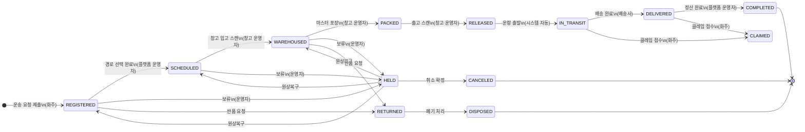
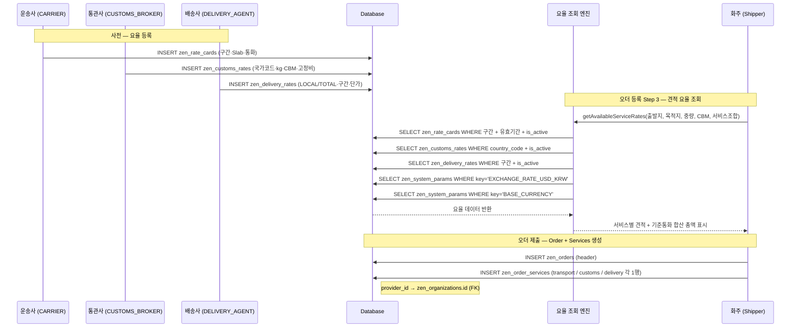
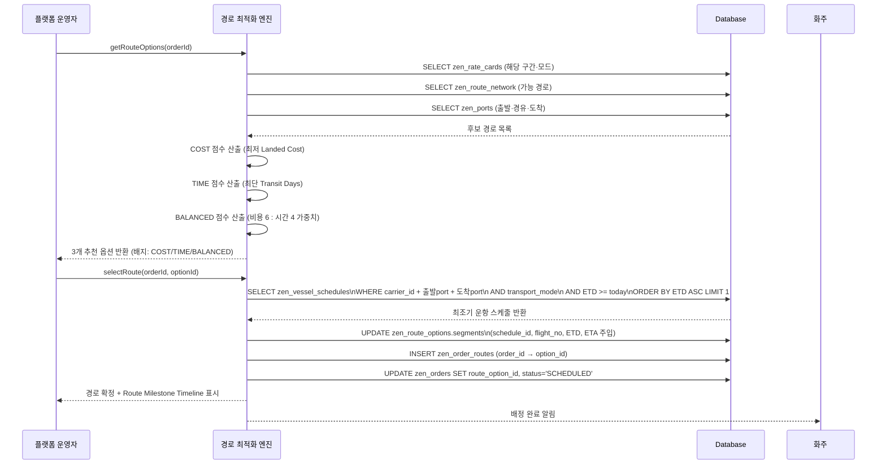

# BF-03 ZENITH_LMS E2E 시퀀스 다이어그램

> **문서번호:** BF-03
> **작성자:** Aiden (Claude, ZEN_CEO)
> **작성일:** 2026-06-10
> **버전:** v1.0
> **기준:** Phase 1~6 구현 완료 현황

---

## 1. 전체 업무 흐름 시퀀스 다이어그램

```mermaid
sequenceDiagram
    actor 화주 as 화주 (Shipper)
    actor 운영자 as 플랫폼 운영자 (MANAGER)
    actor 운송사 as 운송사 (CARRIER)
    actor 통관사 as 통관사 (CUSTOMS_BROKER)
    actor 창고 as 창고 운영자 (OPERATOR)
    actor 배송사 as 배송사 (DELIVERY_AGENT)
    participant 시스템 as 시스템 (System)

    %% ─────────────────────────────────────────────
    rect rgb(220, 235, 255)
        Note over 운송사,시스템: STAGE 0 — 기초정보 설정 (사전 조건)
        운송사->>시스템: 운임 요율 등록 /admin/rates
        Note right of 시스템: zen_rate_cards
        통관사->>시스템: 통관 요율 등록 /admin/customs-rates
        Note right of 시스템: zen_customs_rates
        배송사->>시스템: 배송 요율 등록 /admin/delivery-rates
        Note right of 시스템: zen_delivery_rates
        운영자->>시스템: 운항 스케줄 등록 /admin/schedules
        Note right of 시스템: zen_vessel_schedules
        운영자->>시스템: 시스템 파라미터 설정 (환율·VAT·기준통화)
        Note right of 시스템: zen_system_params
    end

    %% ─────────────────────────────────────────────
    rect rgb(255, 245, 220)
        Note over 화주,운영자: STAGE 1 — 회원 가입 및 조직 승인
        화주->>시스템: 개인/법인 회원 가입 신청
        운송사->>시스템: 서비스 파트너 가입 신청
        통관사->>시스템: 서비스 파트너 가입 신청
        배송사->>시스템: 서비스 파트너 가입 신청
        운영자->>시스템: 서류 심사 및 승인
        시스템-->>화주: 계정 활성화 / 법인 ID(6자리) 발급
        시스템-->>운송사: 역할(CARRIER) 배정 및 활성화
        시스템-->>통관사: 역할(CUSTOMS_BROKER) 배정 및 활성화
        시스템-->>배송사: 역할(DELIVERY_AGENT) 배정 및 활성화
    end

    %% ─────────────────────────────────────────────
    rect rgb(220, 255, 235)
        Note over 화주,시스템: STAGE 2 — 운송 요청 등록 (화주)
        화주->>시스템: Step 1 — 화물 기본정보 입력 (송·수하인, HS코드, 중량/CBM)
        화주->>시스템: Step 2 — 서비스 조합 선택 (AIR_ONLY / AIR+통관 / AIR+통관+배송 등)
        시스템-->>화주: Step 3 — 견적 요율 표시 (운임+통관+배송 합산, 환율 적용)
        Note right of 시스템: getAvailableServiceRates()
        화주->>시스템: Step 4 — 운송 요청 최종 제출
        시스템-->>화주: Order 생성 완료
        Note right of 시스템: status: REGISTERED
    end

    %% ─────────────────────────────────────────────
    rect rgb(255, 225, 225)
        Note over 운영자,시스템: STAGE 3 — 접수 확인·경로 배정·스케줄 자동 매핑
        운영자->>시스템: 오더 목록 확인 및 접수
        운영자->>시스템: 경로 최적화 실행
        Note right of 시스템: getRouteOptions()
        시스템-->>운영자: COST / TIME / BALANCED 3개 옵션 반환
        운영자->>시스템: 경로 선택 (예: BALANCED)
        시스템->>시스템: 운항 스케줄 자동 매핑
        Note right of 시스템: selectRoute() → zen_vessel_schedules<br/>flight_no / ETD / ETA 주입
        시스템-->>화주: 경로 배정 완료 알림
        Note right of 시스템: status: SCHEDULED
    end

    %% ─────────────────────────────────────────────
    rect rgb(240, 225, 255)
        Note over 창고,시스템: STAGE 4 — 창고 입고
        창고->>시스템: 화물 입고 확인 / 바코드 스캔 (GS1-128)
        시스템-->>창고: 입고 확정
        Note right of 시스템: status: WAREHOUSED
        시스템->>시스템: 재고 자동 증가 (zen_inventory)
    end

    %% ─────────────────────────────────────────────
    rect rgb(240, 225, 255)
        Note over 창고,시스템: STAGE 5 — 마스터 포장·출고
        창고->>시스템: 하우스 오더 묶음 → 마스터오더 생성
        Note right of 시스템: status: PACKED
        시스템->>시스템: PDF 운송 라벨 자동 생성
        창고->>시스템: 출고 스캔
        Note right of 시스템: status: RELEASED
        시스템->>시스템: 재고 자동 감소 (zen_inventory)
    end

    %% ─────────────────────────────────────────────
    rect rgb(255, 255, 210)
        Note over 통관사,운영자: STAGE 6 — 수출 통관
        운영자->>시스템: CI (Commercial Invoice) · PL (Packing List) 발행
        통관사->>시스템: 수출 통관 신고 등록
        통관사->>시스템: 수출 통관 신고번호 입력
        시스템-->>화주: 수출 통관 완료 알림
    end

    %% ─────────────────────────────────────────────
    rect rgb(210, 250, 255)
        Note over 화주,시스템: STAGE 7 — 운송 중·실시간 트래킹 (시스템 자동)
        시스템->>시스템: 외부 항공사·선사 API 폴링 (어댑터 패턴)
        Note right of 시스템: status: IN_TRANSIT
        시스템-->>화주: 트래킹 상태 갱신 알림 (이메일·인앱)
        화주->>시스템: 실시간 트래킹 조회 (/tracking)
        운영자->>시스템: RouteConsistencyBadge 정합성 모니터링
    end

    %% ─────────────────────────────────────────────
    rect rgb(255, 255, 210)
        Note over 통관사,시스템: STAGE 8 — 수입 통관
        통관사->>시스템: 수입 통관 신고 등록
        통관사->>시스템: 수입 통관번호 확정 및 화물 반출 처리
        시스템-->>화주: 수입 통관 완료 알림
    end

    %% ─────────────────────────────────────────────
    rect rgb(240, 225, 255)
        Note over 배송사,시스템: STAGE 9 — 현지 배송 (Last Mile)
        배송사->>시스템: 현지 배송 접수
        배송사->>시스템: 배송 완료 처리
        시스템-->>화주: 배송 완료 알림
        Note right of 시스템: status: DELIVERED
    end

    %% ─────────────────────────────────────────────
    rect rgb(220, 255, 220)
        Note over 화주,운영자: STAGE 10 — 정산·청구
        운영자->>시스템: 확정 요금 산출 (실측 중량·연료할증·환율 기준)
        운영자->>시스템: 인보이스 PDF 발행 (다국어, 순번 자동 채번)
        시스템-->>화주: 인보이스 발송
        화주->>시스템: 결제 처리 (월렛 차감 or 이체)
        운영자->>시스템: 세금계산서 발행
        시스템-->>화주: 정산 완료
        Note right of 시스템: status: COMPLETED
    end

    %% ─────────────────────────────────────────────
    rect rgb(255, 230, 230)
        Note over 화주,운영자: STAGE 11 — VOC·클레임 (선택적 예외 흐름)
        화주->>시스템: VOC 등록 (지연·손상·오배송)
        운영자-->>화주: VOC 답변 처리
        화주->>시스템: 클레임 접수
        Note right of 시스템: status: CLAIMED
        운영자->>시스템: 클레임 처리 및 인시던트 비용 차감
        시스템-->>화주: 클레임 처리 결과 통보
    end
```

---

## 2. 오더 상태 머신 (Order Status Machine)

---

## 3. 요율 등록 및 오더 서비스 연결 흐름

---

## 4. 경로 최적화·스케줄 매핑 상세 흐름

---

## 5. 참조 문서

| 문서 | 경로 |
|:---|:---|
| 전체 업무 흐름·구현 매핑 | `docs/02_Analysis/BF_02_전체업무흐름_구현현황_매핑.md` |
| 업무 흐름 정의 (초기) | `docs/02_Analysis/An_02_업무흐름정의.md` |
| 시퀀스 다이어그램 (초기 v1.1) | `docs/02_Analysis/An_05_시퀀스다이어그램.md` |
| Phase 6 역할 모델 설계 | `docs/02_Analysis/An_11_Phase6_신규서비스역할모델_설계.md` |

---

## 📝 개정 이력

| 버전 | 날짜 | 작성자 | 설명 |
|:---|:---|:---|:---|
| v1.0 | 2026-06-10 | Aiden (Claude, ZEN_CEO) | Phase 1~6 구현 완료 기준 E2E 시퀀스 다이어그램 최초 작성 |
