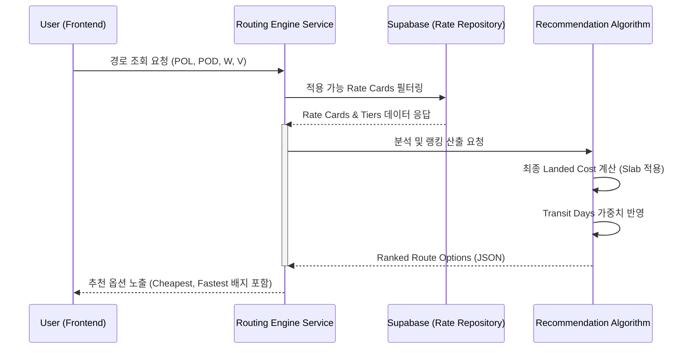

# 301_ROUTING_ENGINE_DESIGN (지능형 라우팅 엔진 설계)

> **프로젝트:** ZENITH_LMS (SNTL 통합 물류 플랫폼)
> **문서번호:** Des-301
> **수수행 주체:** CTO (설계), Execution Agent (문서화)
> **검증 주체:** CEO (비즈니스 부합성), Audit Agent (기술 정합성)
> **작성일:** 2026-04-17
> **버전:** v1.0

## 1. 개요
지능형 라우팅 엔진은 복잡한 요율 체계(항공 Slab, 해상 CBM/FCL)와 실시간 할증료를 분석하여 최적의 운송 경로를 사용자에게 제안합니다.

## 2. 시퀀스 다이어그램 (Sequence Diagram)



## 3. 핵심 알고리즘 및 로직

### 3.1 Slab 요율 기반 최적 비용 산출 (Total Cost Calculation)
항공 화물의 경우 중량 구간별로 단가가 달라지므로, 해당 화물 중량이 속한 구간뿐만 아니라 바로 **다음 구간(+100kg, +300kg 등) 적용 시의 총액**과 비교하여 항상 가장 낮은 값을 선택합니다.

- **로직 (Pseudo Code)**:
  ```javascript
  function calculateBestRate(weight, tiers) {
    const applicableTier = tiers.find(t => weight >= t.min_weight && weight <= t.max_weight);
    const costCurrent = weight * applicableTier.unit_price;
    
    // 다음 구간(Next Higher Break) 체크
    const nextTier = tiers.find(t => t.min_weight > weight);
    if (nextTier) {
      const costNext = nextTier.min_weight * nextTier.unit_price;
      return Math.min(costCurrent, costNext); // 더 저렴한 쪽 리턴
    }
    return costCurrent;
  }
  ```

### 3.2 추천 배지(Badge) 부여 기준
추출된 결과 셋 중 다음 기준에 부합하는 상위 1개씩 배지를 부여합니다.

| 배지 유형 | 선정 로직 | 비고 |
|:---:|:---|:---|
| **Cheapest** | `min(Base Cost + Surcharges)` | 전체 비용 합계 기준 |
| **Fastest** | `min(Transit Days)` | 리드타임 기준 |
| **Best Value** | `(Cost Score * 0.6) + (Days Score * 0.4)` | 가성비 종합 점수 |
| **Node Filter** | `transport_mode` 기반 인프라(AIR-Airport, SEA-Seaport) 자동 필터링 | 정합성 가드레일 |

## 4. 데이터 모델 연동 (ERD Reference)
- `zen_rate_cards`: 기본 서비스 메타데이터 (POL, POD, Transit Days, Carrier)
- `zen_rate_tiers`: 중량/부피 구간별 전용 단가 (`min_weight`, `max_weight`, `unit_price`)

## 5. UI/UX 기대 효과
- 사용자가 복잡한 엑셀 기반 할인표를 직접 계산할 필요가 없음.
- 항공 vs 해상 서비스의 비용/기간 균형점을 직관적으로 비교하여 결정 장애 해소.

---
**Audit Note**: 본 설계는 Phase 2 구현 단계의 백엔드 서비스 개발 규격으로 활용됩니다.

## 6. 개정 이력 (Revision History)
| 버전 | 날짜 | 작성자 | 설명 |
|:---|:---|:---|:---|
| v1.0 | 2026-04-17 | Execution Agent | 초기 설계 수립 |
| v1.1 | 2026-04-21 | Antigravity | 동적 노드 제약 로직 및 모드별 초기화 UX 추가 |
