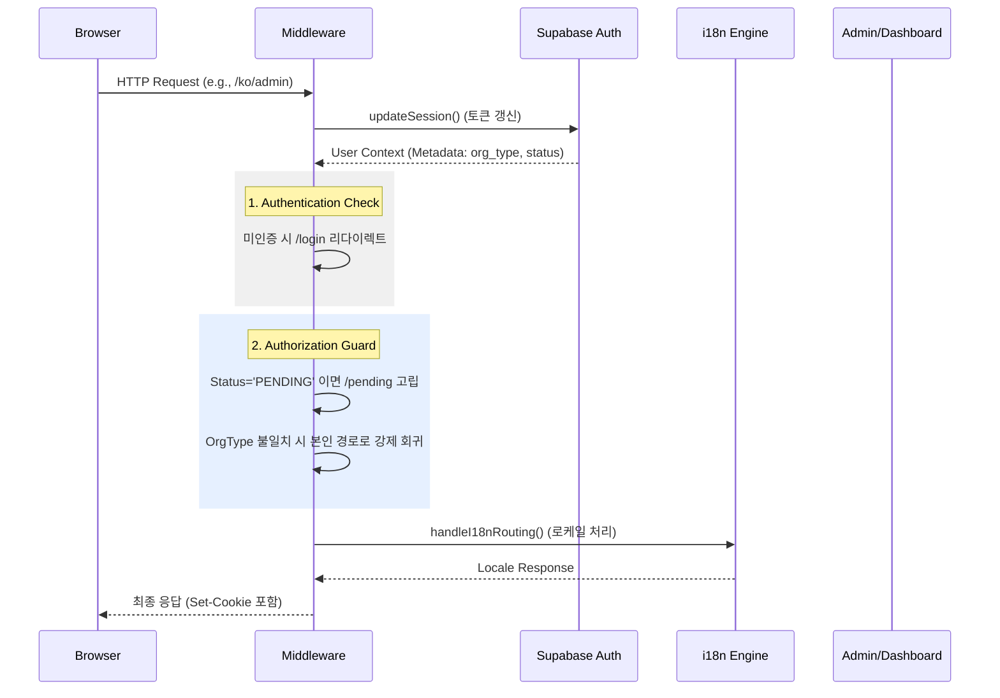

# 302_AUTH_GUARD_ARCHITECTURE (지능형 인증 및 라우팅 아키텍처)

> **프로젝트:** 지능형 통합 물류 플랫폼 (Intelligent Integrated Logistics Platform)
> **문서번호:** Des-302
> **설계 주체:** ZEN_CEO (Gemini 3.1 Pro)
> **승인 주체:** Master Edward
> **작성일:** 2026-04-18
> **버전:** v1.0

## 1. 개요 (Overview)
본 아키텍처는 다국어 환경(next-intl)과 서버리스 인증(Supabase)이 통합된 환경에서, **조직 타입(OrgType)**에 따른 엄격한 경로 격리 및 **사용자 상태(Status)**에 따른 자동 라이프사이클 라우팅을 실현하는 것을 목적으로 한다.

## 2. 통합 미들웨어 파이프라인 (Unified Middleware)

플랫폼의 모든 요청은 하나의 통합 미들웨어를 통과하며, 다음과 같은 순서로 처리된다.

## 3. 핵심 라우팅 규칙 (Routing Rules)

### 3.1 조직별 전용 경로 (Org-Based Isolation)
`src/config/routes.ts`에 정의된 `ORG_ROUTE_MAP`에 따라 각 조직은 서로의 영역을 침범할 수 없다.

| 조직 타입 (OrgType) | 진입 경로 (Route) | 설명 |
|:---:|:---:|:---|
| **PLATFORM** | `/admin` | 전체 시스템 운영 및 승인 관리 |
| **SHIPPER** | `/dashboard` | 송하인 오더 생성 및 트래킹 |
| **CARRIER** | `/terminal` | 운송사 차량 및 배차 관리 |
| **GUEST** | `/pending` | 승인 대기 또는 비인가 사용자 |

### 3.2 사용자 상태 관리 (Status Lifecycle)
사용자의 `app_metadata.status` 값에 따라 UI 진입 권한이 동적으로 변경된다.

- **PENDING**: 가입 직후 상태. 모든 경로는 `/pending`으로 강제 리다이렉트됨.
- **ACTIVE**: 승인 완료 상태. 본인 조직의 `ORG_ROUTE_MAP` 경로 접근 허용.
- **SUSPENDED**: 계정 중지 상태. 로그인 차단 또는 안내 페이지 유도.

## 4. 설정 기반 확장 (Config over Code)

새로운 기능을 추가하거나 조직을 확장할 때 코드가 아닌 **설정 객체**를 수정하는 것을 원칙으로 한다.

### 4.1 신규 조직 추가 프로세스
1. `OrgType` 유니온 타입에 새로운 타입 추가 (예: `CUSTOMS`)
2. `ORG_ROUTE_MAP`에 매핑 경로 추가 (예: `CUSTOMS: '/customs'`)
3. `PERMISSION_MAP`에 해당 역할의 권한 리스트 정의

## 5. 보안 고려사항 (Security)
- **Identity Theft 방지**: 모든 라우팅 결정은 클라이언트 사이드 데이터가 아닌 서버사이드 `supabase.auth.getUser()` 결과에 의존한다.
- **Cookie Synchronization**: i18n 엔진과 Supabase 클라이언트의 쿠키 응답을 미들웨어 레벨에서 병합하여 세션 유실을 방지한다.

---
**Audit Note**: 본 아키텍처는 ZEN_A4 방법론의 'Orthogonal Separation' 원칙을 준수하며, Edward Master의 승인을 득한 표준 규격임.
