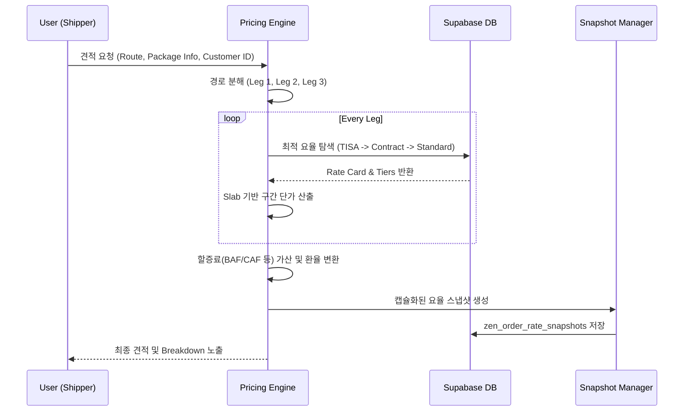

# [Design] 303_COMPOSITE_PRICING_ENGINE (복합 요금 계산 엔진)

**작성일**: 2026-04-19
**승인 주체**: ZEN_CEO
**버전**: v1.2 (v2.2 구현 동기화)

---

## 🏛️ Multi-Agent 종합 의견 (Synthesis)

본 설계안은 ZEN_CEO를 중심으로 각 분야별 전문 에이전트의 의견을 수렴하여 도출되었습니다.

*   **👑 [CEO]**: 플랫폼의 수익성과 고객 신뢰 확보를 위해 모든 계산 과정의 **투명성**과 TISA 기반의 **개인화된 요율** 제공을 최우선으로 함.
*   **🔬 [CTO]**: 대량 오더 처리 시의 **성능(GIST Index)**과 소수점 4자리까지의 **연산 정밀도**, 그리고 오더 시점의 요율을 보존하는 **Snapshotting** 기술 강조.
*   **🎨 [CPO]**: 관리자의 요약/대량 등록 편의성과 화주가 비용 구성을 한눈에 파악할 수 있는 **Cost Breakdown UX** 실장.
*   **🛡️ [Audit]**: 사후 분쟁 방지를 위한 **변경 이력 추적(Audit Trail)** 및 타사 요율 노출 방지를 위한 **RLS(Row Level Security)** 설계 강화.

---

## 🚀 아키텍처 개요 (Architecture Overview)

복합 요금 엔진은 단일 운송(Point-to-Point)부터 복잡한 멀티모달(Multimodal) 경로까지 아우르는 4단계 파이프라인으로 구성됩니다.

### 1. 경로 분해기 (Route Decomposer)
*   **기능**: 출발지(Origin)부터 목적지(Destination)까지의 경로를 독립적으로 연산 가능한 단위인 **Leg(구간)**로 분해합니다.
*   **유형**:
    *   `Pre-carriage`: 출발지 ~ 출발항 (Trucking 등)
    *   `Main-carriage`: 출발항 ~ 도착항 (Air/Sea 등)
    *   `On-carriage`: 도착항 ~ 최종 목적지 (Trucking/Delivery 등)

### 2. 요율 매칭 엔진 (Rate Matching Engine)
*   **우선순위 로직 (Ranking)**:
    1.  **TISA Specific**: `org_id`와 `customer_id`가 모두 일치하는 특약 요율.
    2.  **Organization Contract**: 특정 법인이 아닌 전체 파트너용 계약 요율.
    3.  **Standard Marketplace**: 공용 오픈 요율.
*   **유효 기간 필터**: `valid_from` ~ `valid_to` 범위 내에서 `ACTIVE` 상태인 요율만 추출.

### 3. 슬랩 및 부피 중량 연산 (Slab & Volume Weight Calculator)
*   **Chargeable Weight 결정 (v2.2 표준)**:
    *   **Air/Express (AIR/EXP)**:
        - 공식: `MAX(Actual Gross Weight, (L * W * H * Total Pcs) / 6,000)`
        - 비고: 글로벌 IATA 표준 계수 6,000($167kg/CBM$)을 적용하여 소수점 2자리에서 올림 처리(Ceiling).
    *   **Sea (LCL/FCL)**:
        - 공식: `MAX(Gross Weight(Ton), Volume(CBM))`
        - 비고: 1,000kg 또는 1CBM 중 큰 값을 **Revenue Ton (R.T)**으로 정의하며, 최소 부과 단위인 minimum R.T 정책과 연동. 
*   **Slab 적용**:
    *   `zen_rate_tiers`에서 산출된 Chargeable Weight가 속하는 중량 구간(`weight_min` ~ `weight_max`)을 매칭하여 `unit_price` 적용.
    *   **Total Leg Rate**: `MAX((Chargeable Weight * Unit Price), Min Price)` – 구간별 최소 요금 정책 보장.

### 4. 할증료 레이어 (Surcharge Overlaying)
*   **Add-on**: 유류할증료(Fuel Surcharge), 보안할증료, 통관대행료 등.
*   **계산 방식**: 정액(Flat Fee) 또는 요율 대비 요율(Percentage) 방식 지원.

---

## 📊 데이터 흐름 (Sequence Diagram)



---

## 🔍 정밀도 및 보안 설계

*   **Precision**: 모든 통화 연산은 `NUMERIC(18, 4)`를 기준으로 하며 실시간 기준 환율 테이블(`reference_exchange_rates`)을 참조합니다.
*   **Integrity**: `prevent_rate_overlap` 제약 조건을 통해 동일 구간에 대해 한 고객에게 두 개 이상의 `ACTIVE` 요율이 전달되지 않도록 보장합니다.
*   **Access Control**: 
    ```sql
    CREATE POLICY "Rates Visibility" ON zen_rate_cards
    FOR SELECT USING (
      customer_id IS NULL OR customer_id = auth.uid_org_id()
    );
    ```

---

## 🏛️ 결론 및 검토 의견

본 설계는 SNTL 플랫폼의 중장기적인 **마켓플레이스 확장성**과 **법인별 특화 영업**을 동시에 만족시키는 구조입니다. ZEN_CEO의 최종 승인 후, 본 설계를 기반으로 `pricing_engine`의 Core Logic 구현을 시작할 예정입니다.
