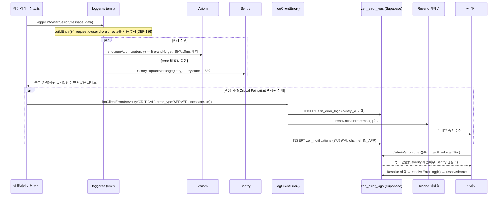

# 305_LOGGING_OBSERVABILITY_ARCHITECTURE (로그·에러 관측성 아키텍처)

> **프로젝트:** 지능형 통합 물류 플랫폼 (Intelligent Integrated Logistics Platform)
> **문서번호:** Des-305
> **설계 주체:** Aiden (Claude, ZEN_CEO)
> **승인 주체:** Master Edward
> **작성일:** 2026-08-23
> **버전:** v1.1 (데이터·이벤트 흐름도 §3 추가)
> **관련 GOV:** GOV_COMMON.md v3.5 (ZEN_A4 §실패 관측성 의무 / §핵심 지점 실시간 알림 의무)
> **관련 Issue:** #1178(TASK-1138, 최초 도입), #1181~#1186(커버리지 확대·알림 경로·조회 UI)

## 1. 배경 (Why)

2026-08-19 이전에는 애플리케이션 로그가 **Vercel Runtime Logs(Hobby 플랜 1시간 보관)**에만 존재해, 발생 직후 짧은 시간이 지나면 어떤 조회도 불가능했다. Web Analytics도 비활성 상태였다. 그 결과 DEF-B-142(SHXK 인증키 미등록 → UPS 발송 전량 실패)가 GoLive 이후 수 주간 발견되지 못했다 — 실패 자체가 어디에도 남지 않았기 때문이다.

TASK-1138(Issue #1178)로 로그 인프라를 도입했으나, 도입 직후 진행한 코드베이스 전수 조사에서 **"로그 인프라가 있어도 코드가 실패를 반환값으로만 조용히 처리하면 아무 소용이 없다"**는 두 번째 문제가 드러났다(약 85건 확인, Issue #1181~1185). 본 문서는 이 두 단계 학습을 반영한 **최종 설계**를 정리한다.

## 2. 3계층 로그 구조 (Three-Tier Architecture)

```mermaid
flowchart TB
    App["애플리케이션 코드\nlogger.info/warn/error()\nsrc/lib/logger.ts"]

    App -->|모든 레벨| Axiom["Axiom\n(zenith_lms_log dataset)\n전체 로그 저장·검색·분석"]
    App -->|error 레벨만| Sentry["Sentry\n(zenith-t2z / javascript-nextjs)\n스택트레이스·이슈그룹핑·세션리플레이"]
    App -->|핵심 지점 CRITICAL만\nlogClientError()| DB[("zen_error_logs\n플랫폼 자체 DB (Supabase)")]

    DB --> Email["Resend 이메일 발송\n(logClientError CRITICAL 분기)"]
    DB --> AdminUI["/admin/error-logs\n관리자 조회 화면"]
    DB -.->|sentry_id 연결| Sentry
```

| 계층 | 용도 | 소유 주체 | 커버 범위 |
|:---|:---|:---|:---|
| **Axiom** | 전체 로그 수집·검색(이용 이력·흐름 분석) | 외부 SaaS(무료 티어) | `logger.*()` 호출 전체 |
| **Sentry** | 에러 심층 디버깅(스택트레이스·breadcrumb·세션 리플레이) | 외부 SaaS(무료 티어) | `logger.error()` 및 React 에러 바운더리 |
| **`zen_error_logs`** | 플랫폼 자체 알림·조회(관리자 실행동선 안) | **플랫폼 자체 소유** | 핵심 지점 CRITICAL 이벤트만 선별 기록 |

**설계 원칙**: 분석·검색처럼 전문성이 필요한 무거운 영역(로그 저장·인덱싱·이슈 dedup)은 SaaS에 위임하되, **"실패 발생 시 누구에게 어떻게 알릴지"는 플랫폼이 직접 소유**한다(SaaS 계정의 Alert Rule에 위임하지 않음 — 계정 접근 제약, 무료 플랜 팀원 초대 제약, 인앱 통합 필요성 등을 이유로 채택하지 않음).

## 3. 데이터 및 이벤트 흐름도 (Data & Event Flow)

### 3.1 이벤트 시퀀스 (실패 발생 시점 기준)



### 3.2 데이터 필드 흐름

| 필드 | 발생 지점 | 도달하는 계층 |
|:---|:---|:---|
| `requestId`/`userId`/`orgId`/`route` | `src/lib/logging/request-context.ts`(DEF-136, AsyncLocalStorage) | Axiom entry, Sentry `contexts.log_entry` |
| `level`(info/warn/error) | `logger.ts` 호출 인자 | Axiom(전체), Sentry(error만) |
| `severity`(WARNING/ERROR/CRITICAL) | `logClientError()` 호출 인자 | `zen_error_logs`만(Axiom/Sentry의 `level`과는 별개 개념) |
| `sentry_id` | `Sentry.captureException()`/`captureMessage()` 반환값 | `zen_error_logs` → `/admin/error-logs` 딥링크로 역참조 |
| `error_type`(CLIENT/SERVER/EDGE) | 호출부에서 명시 | `zen_error_logs` |

## 4. 실패 관측성 원칙 (Observability Principle)

> 상세 규정: `GOV_COMMON.md` § ZEN_A4 Core Principles

로그 인프라가 있어도, 코드가 실패를 아래처럼 처리하면 어떤 계층에도 기록되지 않는다:

```ts
// ❌ 안티패턴 — 로그 인프라 무용지물
if (orderRes.success === 0) return { error: orderRes.message };
```

**원칙**: 실패를 반환값(`{success:false}`, `{error:...}`, `null`)으로 전달하는 모든 지점에서, 반환 이전에 반드시 `logger.error()`(시스템/외부 API 실패) 또는 `logger.warn()`(예상 가능한 업무 실패)을 호출한다. `catch (err)` 블록에서 `err` 자체를 로깅 없이 버리는 것도 별도 금지 대상이다. 서버 액션의 `withAction()` 래퍼는 **throw된 예외만** 자동으로 잡아주므로, 반환값 기반 실패에는 이 원칙이 여전히 필요하다.

**최초 발견 규모**: 2026-08-22 전수 조사 기준 약 85개 지점(ups-labels.ts ~40건, shxk/order·tracking 6건, ups-actual-charges/cost ~21건, DatabaseRouteAdapter.ts 2건, admin/auth.ts 5건 등) — Issue #1181~1185로 순차 해소 중.

## 5. 핵심 지점(Critical Point) 판단 기준과 알림 경로

전수 로깅만으로는 사람이 대시보드를 능동적으로 확인해야 문제를 알 수 있다. 아래 4개 기준 중 **2개 이상** 해당하는 실패 지점은 로깅에 더해 실시간 알림을 구성한다.

| 기준 | 질문 |
|:---|:---|
| ① 금전적 영향 | 실패가 금액 계산·청구·정산·비용 기록에 영향을 주는가 |
| ② 외부 SLA/고객 접점 | 실패가 고객에게 약속된 서비스 수행 실패로 직결되는가 |
| ③ 침묵성(Silent failure) | 실패해도 즉각적인 가시 신호 없이 조용히 넘어가는가(비동기·배치·백그라운드일수록 해당) |
| ④ 과거 사고 이력 | 동일·유사 유형 실패가 실제 장애로 이어진 전례가 있는가 |

### 5.1 알림 구현 방식

Cron 폴링이 아니라, **실패 발생 시점에 동기 호출**해 진짜 실시간을 확보한다:

1. 핵심 지점 실패 시 `logger.error()`와 별개로 `logClientError({severity:'CRITICAL', error_type:'SERVER', message, url})`(`src/app/actions/misc/monitoring.ts`)를 호출 → `zen_error_logs`에 즉시 기록
2. `logClientError()`의 CRITICAL 분기는 기존 `sendInAppNotification()`(인앱 알림)에 더해 **이메일 발송**(`src/lib/notifications/email.ts`의 Resend 연동 패턴 재사용)까지 수행하도록 확장
3. `/admin/error-logs` 화면이 플랫폼 자체 "진행 중 장애" 뷰 역할을 겸함(§6 참조)

### 5.2 최초 적용 판정 결과

| Issue | 대상 | 판정 |
|:---|:---|:---|
| #1181 | ups-labels.ts | **핵심 지점**(①②③④ 전부 해당) |
| #1182 | shxk/order.ts·tracking.ts | **핵심 지점**(order.ts는 즉시 CRITICAL, tracking.ts는 WARNING 기록) |
| #1183 | ups-actual-charges/cost.ts | **핵심 지점**(①③ 해당) |
| #1184 | DatabaseRouteAdapter.ts | 로깅만으로 충분 |
| #1185 | admin/auth.ts | 로깅만으로 충분(에러 화면 즉시 노출로 침묵성 없음) |

## 6. 관리자 조회 UI (`/admin/error-logs`)

`ErrorLogsTable.tsx` + `getErrorLogs()`(`src/app/actions/misc/monitoring.ts`)로 `zen_error_logs`를 조회한다. Severity 배지, 에러 메시지, 발생 URL, 사용자 정보, Sentry 딥링크(`https://zenith-t2z.sentry.io/issues/?query={sentry_id}`), 해결 상태(Resolve 버튼)를 제공한다.

**2026-08-23 기준 알려진 한계**(Issue #1186로 개선 예정):
- 서버 함수(`getErrorLogs`)는 severity/resolved 필터를 지원하나 화면에 필터 UI 자체가 없음
- 오더/reference_no와의 직접 연결 없음
- 키워드 검색 없음

## 7. 알려진 한계 및 향후 과제

- **Fire-and-forget 유실 가능성**: Axiom 전송은 서버리스 함수 freeze 직전 호출분이 유실될 수 있음(`axiom-transport.ts` 배치 큐 특성). 핵심 지점은 `zen_error_logs` 동기 insert로 보완되므로 영향 낮음.
- **Sentry 무료(Developer) 플랜**: 1인 전용이라 Team B 등 타 인원 초대 불가 — 필요 시 유료 플랜 전환 검토 필요(현재는 보류, Edward 결정 2026-08-22).
- **Vercel Hobby 플랜 Runtime Logs 1시간 보관**: 근본적으로 플랫폼 자체 로그(Axiom/Sentry/`zen_error_logs`)로 우회했으므로 실사용에 지장 없음.
- **로그 분석 엔진 자체 구축은 채택하지 않음**: Axiom/Sentry가 제공하는 저장·검색·dedup·스택트레이스 심볼화 등은 비용 대비 자체 구축 효율이 낮다고 판단(§2 원칙 참조). 알림 발송 책임만 플랫폼이 소유.

## 8. 관련 Issue 이력

| Issue | 내용 | 상태(2026-08-23 기준) |
|:---|:---|:---|
| #1178(TASK-1138) | Axiom+Sentry 최초 연동 | ✅ Closed |
| #1181(TASK-B-319) | ups-labels.ts 로깅+알림 추가 | 진행 대기 |
| #1182(TASK-B-320) | shxk/order·tracking 로깅+알림 추가 | 진행 대기 |
| #1183(TASK-B-321) | ups-actual-charges/cost 로깅+알림 추가 | 진행 대기 |
| #1184(TASK-1139) | DatabaseRouteAdapter.ts 로깅 추가 | 진행 대기 |
| #1185(TASK-B-322) | admin/auth.ts 예외 폐기 패턴 수정 | 진행 대기 |
| #1186(TASK-1140) | `/admin/error-logs` 필터·검색 UI 개선 | 진행 대기 |

---
**Audit Note**: 본 문서는 2026-08-20~23 세션에서 Aiden·Edward가 배포 검증·실사고(SHXK) 재분석·코드베이스 전수 조사를 거쳐 확정한 로그 아키텍처를 정리한 것이며, `GOV_COMMON.md` v3.3~v3.5의 근거 문서다.
