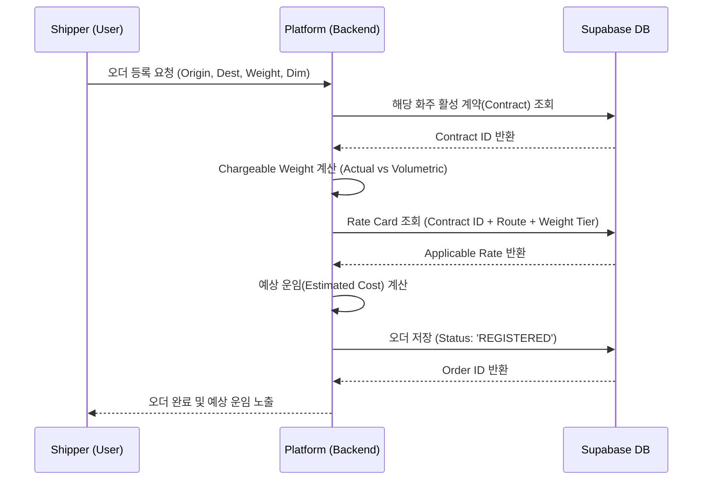
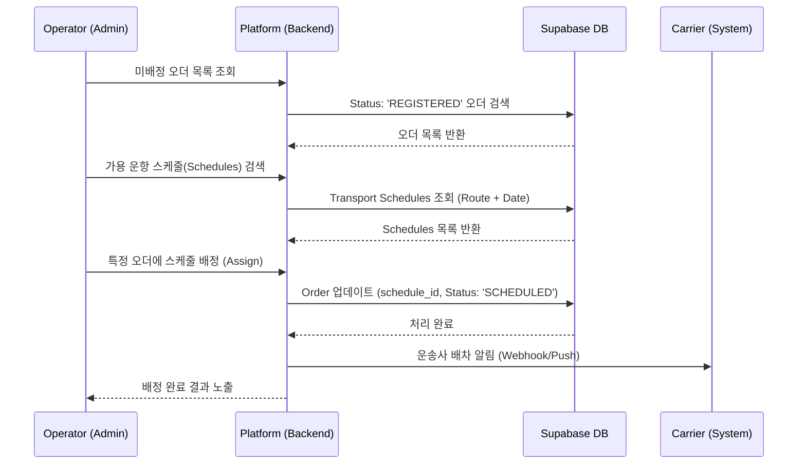

# 물류 서비스 시퀀스 다이어그램 (Logistics Sequence Diagrams)

> **프로젝트:** ZENITH_LMS (SNTL 통합 물류 플랫폼)
> **문서번호:** Ds-06
> **작성자:** CTO (Antigravity Architect)
> **작성일:** 2026-04-17
> **버전:** v1.0

본 문서는 플랫폼의 핵심 비즈니스 로직인 계약 기반 운임 산정과 사후 스케줄 배정의 시스템 간 상호작용을 정의합니다.

## 1. 오더 등록 및 계약 기반 운임 산정 (Order & Estimation)
화주가 오더를 등록할 때, 등록된 계약(Contract) 및 요율(Rate Card) 정보를 바탕으로 예상 운임을 즉시 산출합니다.

## 2. 운항 스케줄 사후 배정 (Post-Schedule Assignment)
등록된 오더에 대해 운영자가 실제 운송 수단(항공/해상/육상)의 스케줄을 배정합니다.

## 3. 항공 물류 특화: 부피 중량 및 구간 요율 로직
항공 물류의 경우, 다음의 복합 로직이 시스템 내부적으로 수행됩니다.

1.  **Volumetric Weight**: `(Width * Height * Length) / Divisor` (기본 6,000)
2.  **Chargeable Weight**: `MAX(Actual Weight, Volumetric Weight)`
3.  **Tier Pricing**:
    - Weight < 45kg: Min Rate 적용
    - 45kg <= Weight < 100kg: +45 Tier Rate 적용
    - Weight >= 100kg: +100 Tier Rate 적용
