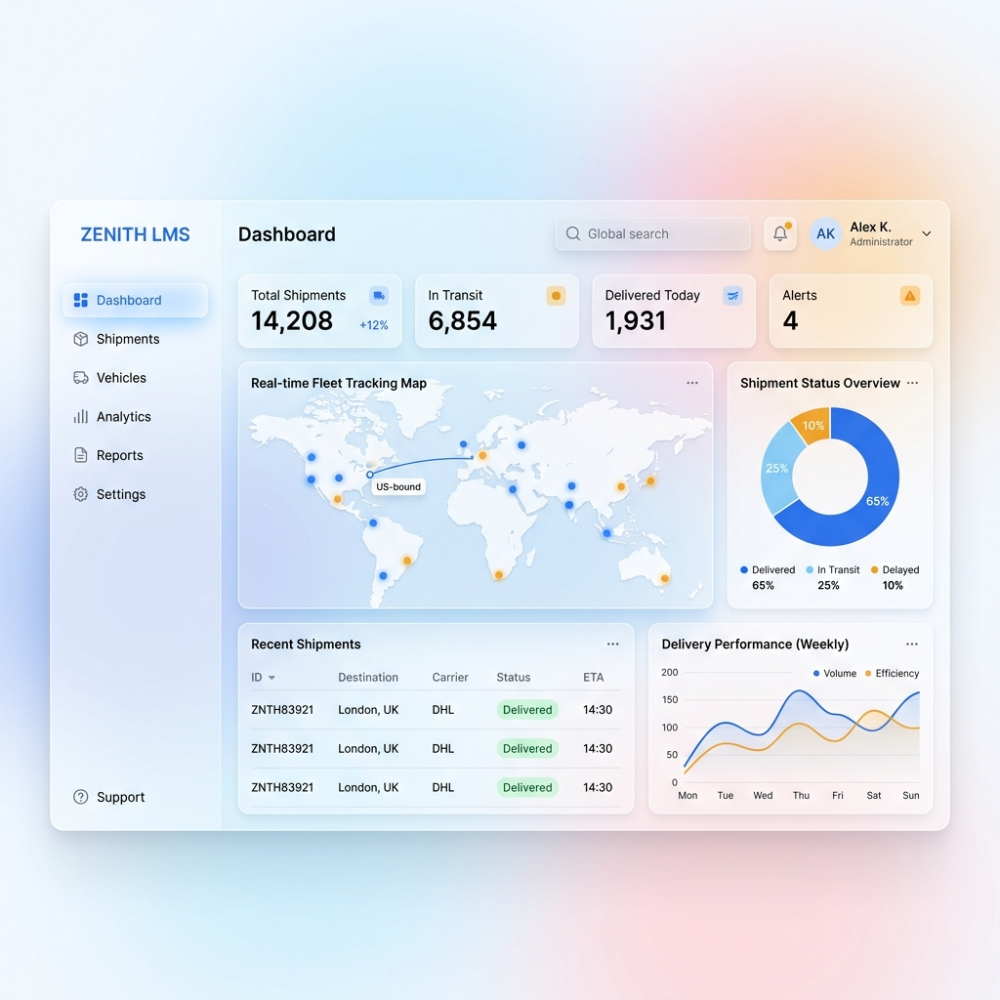
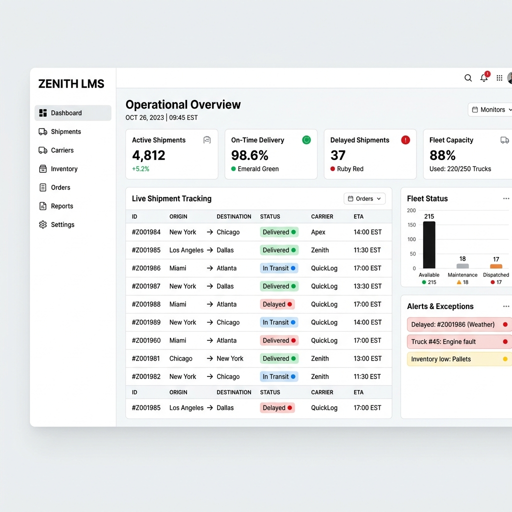
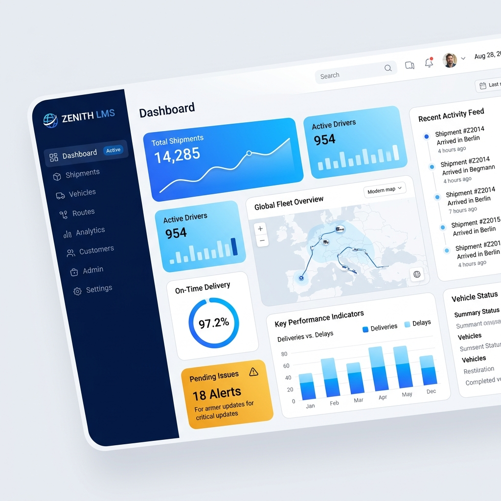
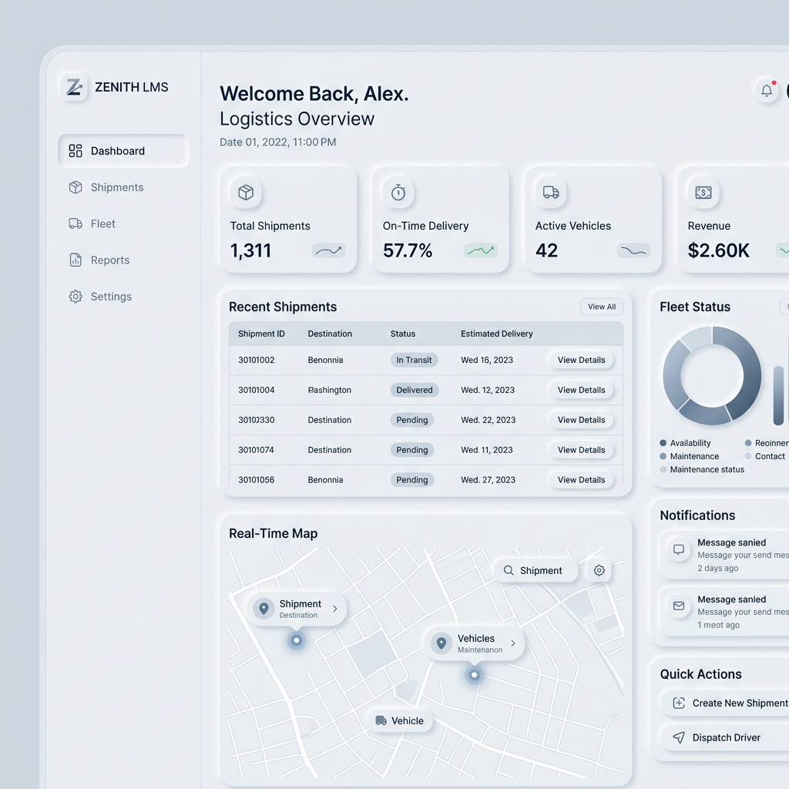
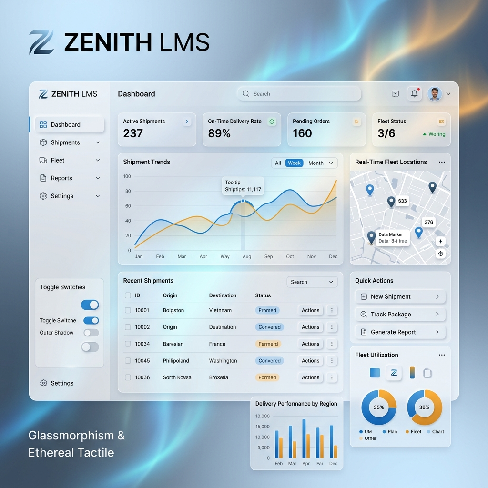

# 아. UI 디자인 시안 분석 보고서 (An_08_UI_Design_Proposals)

> **프로젝트:** ZENITH_LMS (SNTL 통합 물류 플랫폼)
> **문서번호:** An-08
> **수행 주체:** Execution Agent (자산 구성 및 문서화)
> **검증 주체:** CEO (최종 승인)
> **작성일:** 2026-04-17
> **버전:** v1.0

## 1. 개요
본 문서는 ZENITH_LMS의 브랜드 정체성과 사용자 경험(UX)을 극대화하기 위해 제안된 5가지 UI 디자인 시안을 기록하고 분석합니다. 각 시안은 현대적인 물류 시스템의 복잡성을 해결하고 프리미엄한 가치를 전달하도록 설계되었습니다.

---

## 2. 디자인 시안 목록 (Design Proposals)

### 2.1 Proposal 1: Ethereal Clarity
가장 깨끗하고 전문적인 느낌을 주는 화이트 톤의 시안입니다.
- **컨셉**: 미니멀리즘, 여백의 미, 전문성.
- **특징**: 고대비 텍스트와 넓은 여백을 통해 데이터 가독성을 극대화함.

### 2.2 Proposal 2: Industrial Precision
전통적인 물류 시스템의 신뢰감과 정밀함을 현대적으로 재해석한 시안입니다.
- **컨셉**: 신뢰, 정확성, 그리드 시스템.
- **특징**: 안정적인 격자 구조와 짙은 네이비 톤을 사용하여 대량의 정보 처리에 용이함.

### 2.3 Proposal 3: Digital Horizon
미래지향적이고 역동적인 비즈니스 성장을 상징하는 시안입니다.
- **컨셉**: 미래, 성장, 다이내믹 그라데이션.
- **특징**: 강렬한 브랜드 컬러와 부드러운 그라데이션을 사용하여 사용자에게 활력을 부여함.

### 2.4 Proposal 4: Tactile Flow
사용자의 조작감과 흐름(Flow)을 중시한 인간 중심 디자인 시안입니다.
- **컨셉**: 인터랙션, 부드러움, 촉각적 경험.
- **특징**: 둥근 모서리와 레이어드 그림자를 통해 요소 간의 계층 구조를 명확히 함.

### 2.5 Proposal 5: Ethereal Tactile Hybrid (최종 선정 후보)
미니멀리즘과 입체적인 인터랙션이 조화롭게 결합된 최상위 프리미엄 시안입니다.
- **컨셉**: 하이브리드, 글래스모피즘(Glassmorphism), 최첨단.
- **특징**: 반투명 레이어와 세밀한 마이크로 애니메이션의 조화로 최첨단 플랫폼의 이미지를 강력하게 전달함.

---

## 3. 분석 결과 요약
5가지 시안 모두 현대적인 디자인 트렌드를 반영하고 있으며, 특히 **Digital Horizon**과 **Ethereal Tactile Hybrid** 시안이 ZENITH_LMS의 지능형 물류 플랫폼 정체성을 가장 잘 나타내는 것으로 평가되었습니다.

---

## 📝 개정 이력 (Revision History)

| 버전 | 날짜 | 작성자 | 설명 |
|:---|:---|:---|:---|
| v1.0 | 2026-04-17 | Execution Agent | 초기 UI 디자인 시안 자산화 및 문서 생성 |
