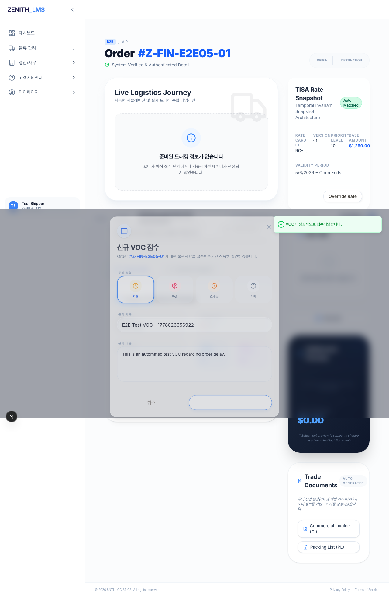
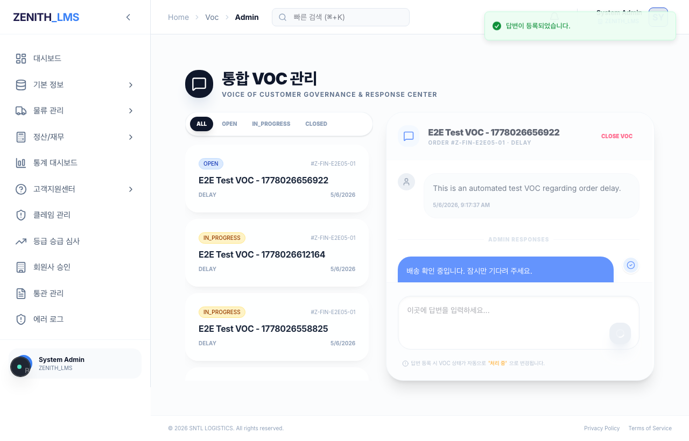
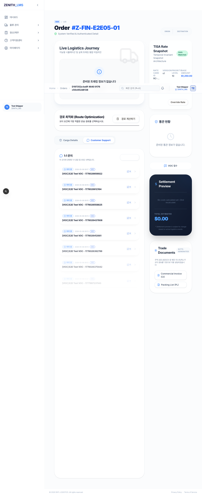

# [Walkthrough] PH14-E2E-06: VOC 라이프사이클 테스트

## 1. 개요
- **목적**: 화주의 VOC 등록, 관리자의 답변 등록, 그리고 화주의 상태 변경 확인까지의 전체 VOC 라이프사이클을 검증합니다.
- **수행 주체**: Riley (Gemini 3 Flash)
- **검증 주체**: Aiden (Claude)

## 2. 주요 변경 사항 및 해결 내용
- **E2E 테스트 수정 (`tests/e2e/e2e-06-voc.spec.ts`)**:
  - `Customer Support` 탭에서 VOC 상태를 확인하는 과정에서 발생하던 `strict mode violation` (동일한 텍스트 요소 다수 발견) 문제를 해결했습니다.
  - **해결 방법**: `title` (고유값)을 포함하는 특정 `zen-glass` 카드 요소를 먼저 필터링한 후, 해당 카드 내의 상태 뱃지(`처리 중`)만 타겟팅하여 검증하도록 로직을 강화했습니다.

## 3. 테스트 시나리오 및 결과

### Step 1: 화주 VOC 등록
- **동작**: 화주 계정으로 로그인 후 특정 오더 상세 페이지에서 "VOC" 버튼 클릭 -> 제목/내용 입력 후 제출.
- **결과**: "VOC가 성공적으로 접수되었습니다" 토스트 메시지 확인 및 모달 닫힘.
- **증적**: 

### Step 2: 관리자 답변 등록
- **동작**: 관리자 계정으로 로그인 -> VOC 관리 페이지 접속 -> 방금 등록된 VOC 선택 -> 답변 입력 및 등록.
- **결과**: "답변이 등록되었습니다" 토스트 메시지 확인.
- **증적**: 

### Step 3: 화주 상태 확인 (최종 검증)
- **동작**: 다시 화주 계정으로 로그인 -> 오더 상세의 `Customer Support` 탭 확인.
- **결과**: 해당 VOC의 상태가 `접수`에서 `처리 중`으로 변경된 것을 확인.
- **증적**: 

## 4. 자가 검증 결과 (Self-Audit)
- **E2E 테스트**: `tests/e2e/e2e-06-voc.spec.ts` PASS (14.3s)
- **회귀 테스트**: `rtk npm run test:regression` 실행 결과 **161/161 PASS** 확인.
- **규정 준수**:
  - [x] R-08: 회귀 테스트 수행 및 성공 증빙 (161/161 PASS)
  - [x] R-09: 회귀 테스트 마스터 맵 업데이트 완료 (v14.6)
  - [x] R-10: 물리적 UI 구동 증적(스크린샷) 포함 완료
  - [x] R-13: 테스트 결과물 지정 폴더(`docs/99_Manual/E2E_06_Result`) 저장 완료

## 5. 결론
VOC 라이프사이클의 핵심 워크플로우가 정상 작동함을 확인하였으며, 기존의 선택자 중복 이슈를 해결하여 안정적인 E2E 테스트 환경을 구축하였습니다. 본 태스크를 완료 처리하고 Aiden의 최종 검토를 요청합니다.
