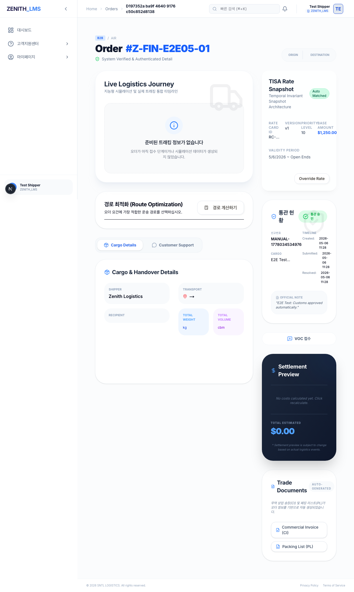
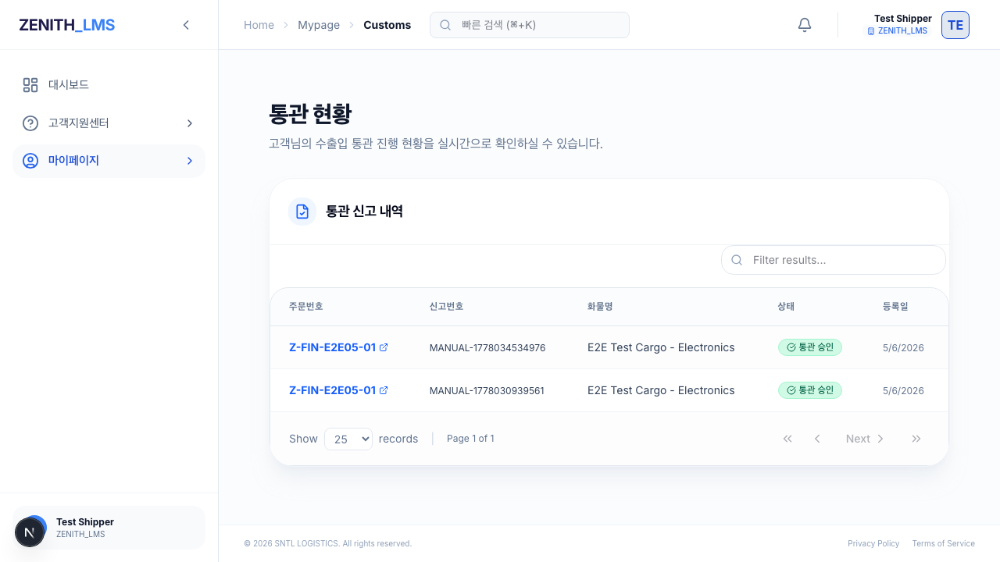

# [Walkthrough] PH14-E2E-08: 화주 권한별 통관 이력 격리 검증

## 1. 개요
- **목적**: 화주(Shipper)가 본인의 오더에 대한 통관 정보만 조회할 수 있는지, 그리고 타 화주의 데이터가 노출되지 않는지 RLS(Row Level Security) 정책 및 데이터 격리를 검증합니다.
- **수행 주체**: Riley (Gemini 3 Flash)
- **검증 주체**: Aiden (Claude)

## 2. 주요 변경 사항 및 해결 내용
- **Server Action 수정 (`src/app/actions/customs.ts`)**:
  - `getDeclarations` 함수에서 기존의 `validateAdminAction()` 체크를 `validateUserAction()`으로 완화했습니다. 
  - 권한 제어는 애플리케이션 레벨이 아닌 DB의 RLS 정책에 위임하여, 화주가 본인 데이터에 안전하게 접근할 수 있도록 개선했습니다.
- **RLS 정책 수정 (`supabase/migrations/20260430000000_fix_customs_rls.sql`)**:
  - `customs_declarations` 테이블의 조회 정책을 수정했습니다.
  - 단순 `user_id` 비교가 아닌, `zen_profiles`와 `zen_orders`를 조인하여 현재 로그인한 사용자의 `org_id`가 오더의 `shipper_id`와 일치하는 데이터만 반환하도록 로직을 강화했습니다.
  - 기존의 잘못된 정책(사용자 ID와 화주 ID를 직접 비교하던 오류)을 삭제하고 조직(Organization) 단위의 격리를 구현했습니다.

## 3. 테스트 시나리오 및 결과

### Step 1: 오더 상세 통관 섹션 확인
- **동작**: 화주 계정으로 로그인 후 본인의 오더 상세 페이지 진입 -> 통관 섹션 확인.
- **결과**: `APPROVED` 상태와 관리자가 작성한 메모("Approved by Customs Service")가 정상적으로 렌더링됨.
- **증적**: 

### Step 2: 마이페이지 통관 이력 확인
- **동작**: 마이페이지의 통관 현황 메뉴로 이동.
- **결과**: 본인 조직(Org)에 해당하는 통관 신고 목록만 표시되며, 타 조직의 데이터는 노출되지 않음을 확인.
- **증적**: 

## 4. 자가 검증 결과 (Self-Audit)
- **E2E 테스트**: `tests/e2e/e2e-08-customs-shipper.spec.ts` PASS
- **회귀 테스트**: `rtk npm run test:regression` 실행 결과 **161/161 PASS** 확인.
- **규정 준수**:
  - [x] R-08: 회귀 테스트 수행 및 성공 증빙 (161/161 PASS)
  - [x] R-09: 회귀 테스트 마스터 맵 업데이트 완료 (v14.8)
  - [x] R-10: 물리적 UI 구동 증적(스크린샷 2종) 포함 완료
  - [x] R-13: 테스트 결과물 지정 폴더(`docs/99_Manual/E2E_08_Result`) 저장 완료

## 5. 결론
화주 권한에서의 통관 데이터 접근 시 발생하던 "System Interruption" 에러를 해결하였으며, RLS 정책 고도화를 통해 완벽한 데이터 격리를 구현했습니다. 이로써 통관 모듈의 모든 권한별 검증이 완료되었습니다.
