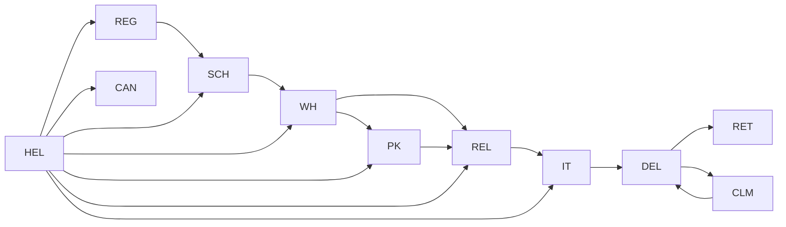

# UAT-02-04 개선 계획 — 오더 상태 전이 전체 플로우

> **문서번호**: UAT-REPORT-002
> **작성일**: 2026-05-28
> **작성자**: B_Kai (OpenCode)
> **버전**: v1.0
> **대상 파일**: `docs/91_FinalTest/UAT/UAT_02_오더관리.md`
> **관련 보고서**: [UAT_GAP_ANALYSIS_20260528.md](UAT_GAP_ANALYSIS_20260528.md) §3.1

---

## 1. 현행 분석

### 현재 UAT-02-04 (v1.0)

| 항목 | 내용 |
|:-----|:------|
| **제목** | 오더 상태 전이 전체 플로우 (PENDING→WAREHOUSED) |
| **단계 수** | 4단계 |
| **커버 전이** | 1개 (PENDING→WAREHOUSED) |
| **역할** | ADMIN |
| **소요 시간** | 10분 |

### 문제점

| # | 문제 | 상세 |
|:-:|:-----|:------|
| 1 | **존재하지 않는 상태명 사용** | "PENDING"은 실제 OrderStatus enum에 없음. 정확한 명칭은 `REGISTERED`. UAT 수행자가 StatusChangeModal에서 찾을 수 없어 혼란 |
| 2 | **SKIP된 상태 전이** | 시스템 status-machine.ts는 `REGISTERED→SCHEDULED→WAREHOUSED→PACKED→RELEASED→IN_TRANSIT→DELIVERED`의 7개 상태를 정의하나, 현재 UAT는 REGISTERED→WAREHOUSED 1개만 테스트 |
| 3 | **생애주기 불완전** | "전체 플로우"라는 제목과 달리 창고 입고 이전 단계만 커버. 배송·도착 등 후반부 전이 완전히 누락 |

---

## 2. 시스템 상태 전이 맵 (Status Machine)

`src/lib/logistics/status-machine.ts` 기준 실제 전이 규칙:



| 상태 | 의미 | 표시 색상 |
|:-----|:-----|:---------|
| `REGISTERED` | 등록 완료 | 파랑 |
| `SCHEDULED` | 스케줄 확정 | 남색 |
| `WAREHOUSED` | 입고 완료 | 노랑 |
| `PACKED` | 패킹 완료 | 주황 |
| `RELEASED` | 출고 확정 | 보라 |
| `IN_TRANSIT` | 운송 중 | 청록 |
| `DELIVERED` | 배송 완료 | 초록 |
| `HELD` | 보류 | 빨강 |
| `CANCELED` | 취소 | 회색 |
| `RETURNED` | 반송 | 장미 |
| `CLAIMED` | 클레임 | 호박 |
| `DISPOSED` | 폐기 | 돌 |

---

## 3. 개선 방안

### 방안 A (권장) — 단일 시나리오 통합

UAT-02-04를 **ADMIN이 StatusChangeModal로 직접 전이 가능한 전체 경로**로 확장:

#### 변경 사항

| 현재 | → 개선 |
|:-----|:-------|
| 제목: PENDING→WAREHOUSED | 제목: **REGISTERED→DELIVERED (핵심 생애주기 6개 전이)** |
| 단계: 4단계 | 단계: **12단계** (6개 전이 × 각각 선택+확인) |
| 소요 시간: 10분 | 소요 시간: **15분** |
| 전제조건: PENDING 1건 | 전제조건: **REGISTERED 상태 오더 1건** |

#### 테스트 절차 (안)

| 순서 | 수행 액션 | 입력/선택 | 기대 결과 |
|:----:|:---------|:----------|:---------|
| 1 | 오더 목록 → 상태 필터 'REGISTERED' | 필터: REGISTERED | REGISTERED 오더만 표시 |
| 2 | 상태 배지 클릭 → 'SCHEDULED' 선택 후 변경 | SCHEDULED | 토스트 "상태가 변경되었습니다" |
| 3 | 배지 확인 | — | SCHEDULED(남색)로 변경 |
| 4 | 상태 배지 재클릭 → 'WAREHOUSED' 선택 후 변경 | WAREHOUSED | 토스트 표시 |
| 5 | 배지 확인 | — | WAREHOUSED(노랑)로 변경 |
| 6 | 상태 배지 재클릭 → 'RELEASED' 선택 후 변경 | RELEASED | 토스트 표시 (출고 확정 — IMP-074) |
| 7 | 배지 확인 | — | RELEASED(보라)로 변경 |
| 8 | 상태 배지 재클릭 → 'IN_TRANSIT' 선택 후 변경 | IN_TRANSIT | 토스트 표시 |
| 9 | 배지 확인 | — | IN_TRANSIT(청록)로 변경 |
| 10 | 상태 배지 재클릭 → 'DELIVERED' 선택 후 변경 | DELIVERED | 토스트 표시 |
| 11 | 배지 확인 | — | DELIVERED(초록)로 변경 |
| 12 | 오더 상세 → 히스토리 탭 | — | REGISTERED→SCHEDULED→WAREHOUSED→RELEASED→IN_TRANSIT→DELIVERED 6개 전이 이력 전체 기록 확인 |

#### 합격 기준 (안)

- [ ] 전 단계 ☑ 완료
- [ ] REGISTERED→SCHEDULED→WAREHOUSED→RELEASED→IN_TRANSIT→DELIVERED 6개 전이 각각 성공
- [ ] 각 전이 후 상태 배지 색상이 ORDER_STATUS_META 정의와 일치
- [ ] 오더 히스토리에 6개 전이 이력 전체 기록 확인 (변경 전·후·일시·수행자)
- [ ] 중간 상태(SCHEDULED·RELEASED·IN_TRANSIT)에서 오더 상세 정보 정상 표시 확인

#### 장점

- 1개 시나리오로 오더 전 생애주기 커버
- 상태명 시스템 정확성 100% 일치
- 히스토리 6건 일괄 검증 가능
- PACKED/정산 등 타 시나리오와 교차 참조만 명시하면 중복 없음

#### 단점

- 단계 수 12개로 다소 길어짐
- UAT 수행 시 REGISTERED 오더 1건이 처음부터 필요 (시드 데이터 의존)

---

### 방안 B — 분할 유지 + 보강

현재 구조를 유지하되 **UAT-02-11** 신규 시나리오로 후반부 커버:

| 시나리오 | 커버 전이 | 단계 |
|:---------|:---------|:----:|
| UAT-02-04 (수정) | REGISTERED→SCHEDULED→WAREHOUSED | 6단계 |
| UAT-02-11 (신규) | RELEASED→IN_TRANSIT→DELIVERED | 8단계 |

→ 방안 A보다 복잡도 증가 (시나리오 분할·UAT_MASTER 갱신 필요)

---

## 4. 권장: 방안 A

| 항목 | 판단 |
|:-----|:-----|
| **선택** | **방안 A** (단일 시나리오 통합) |
| **사유** | "전체 플로우"라는 제목에 부합, 상태명 오류(PENDING) 즉시 해소, 히스토리 6건 일괄 검증으로 검증 효율 극대화 |
| **PACKED 처리** | UAT-04-07(패킹)에서 커버되므로 UAT-02-04에서는 SKIP. 절차 내 교차 참조 메모 추가 |
| **정산(PAID) 처리** | UAT-05(정산)에서 커버. UAT-02-04에서는 DELIVERED에서 종료 |
| **HELD 테스트** | UAT-02-05에서 이미 전용 시나리오로 커버 중 |

### 변경 대상 파일

| 파일 | 작업 | 예상 라인 |
|:-----|:-----|:---------:|
| `docs/91_FinalTest/UAT/UAT_02_오더관리.md` | UAT-02-04 전면 재작성 (PENDING→REGISTERED, 4단계→12단계) | 30줄 |
| `docs/91_FinalTest/UAT/UAT_MASTER.md` | UAT-02-04 시나리오명 갱신 | 1줄 |

### 수정 후 예상 구조

```markdown
## [UAT-02-04] 오더 상태 전이 전체 플로우 (REGISTERED→DELIVERED)

| 항목 | 내용 |
|:----|:----|
| 역할 | ADMIN |
| 화면 URL | /ko/login → /ko/orders |
| 예상 소요 시간 | 15분 |
| 사전 조건 | ADMIN 계정(`admin@zenith.kr`) 로그인 상태, REGISTERED 상태 오더 1건 존재 |

### 테스트 절차

| 순서 | 화면·URL | 수행 액션 | 입력 데이터 | 기대 결과 | 확인 |
|:---:|:---------|:---------|:-----------|:---------|:----:|
| 1 | /ko/orders | 상태 필터 'REGISTERED' 선택 | — | REGISTERED 오더만 표시 | ☐ |
| 2 | /ko/orders | REGISTERED 오더 상태 배지 클릭 | — | StatusChangeModal 오픈, SCHEDULED 포함 확인 | ☐ |
| 3 | /ko/orders | REGISTERED→SCHEDULED 전이 | 'SCHEDULED' 선택 → 변경 | 토스트 "상태가 변경되었습니다" | ☐ |
| 4 | /ko/orders | 배지 SCHEDULED(남색) 확인 | — | ORDER_STATUS_META 색상과 일치 | ☐ |
| 5 | /ko/orders | 상태 배지 재클릭 → SCHEDULED→WAREHOUSED | 'WAREHOUSED' 선택 → 변경 | 토스트 표시 | ☐ |
| 6 | /ko/orders | 배지 WAREHOUSED(노랑) 확인 | — | — | ☐ |
| 7 | /ko/orders | WAREHOUSED→RELEASED (출고 확정) | 'RELEASED' 선택 → 변경 | 토스트 표시 | ☐ |
| 8 | /ko/orders | 배지 RELEASED(보라) 확인 | — | — | ☐ |
| 9 | /ko/orders | RELEASED→IN_TRANSIT | 'IN_TRANSIT' 선택 → 변경 | 토스트 표시 | ☐ |
| 10 | /ko/orders | 배지 IN_TRANSIT(청록) 확인 | — | — | ☐ |
| 11 | /ko/orders | IN_TRANSIT→DELIVERED | 'DELIVERED' 선택 → 변경 | 토스트 표시 | ☐ |
| 12 | /ko/orders | 배지 DELIVERED(초록) 확인 | — | — | ☐ |
| 13 | /ko/orders/[id] | 오더 상세 → 히스토리 탭 | — | 6개 전이 이력 전체 기록 확인 | ☐ |

### 합격 기준
- [ ] 전 단계 ☑ 완료
- [ ] REGISTERED→SCHEDULED→WAREHOUSED→RELEASED→IN_TRANSIT→DELIVERED 6개 전이 성공
- [ ] 각 전이 후 상태 배지 색상 정확
- [ ] 오더 히스토리에 6개 전이 이력 전체 기록 (변경 전·후·일시·수행자)
- [ ] WAREHOUSED→RELEASED 출고 확정 (출고 처리 화면 UAT-04-06 참조)
- [ ] DELIVERED 이후 정산은 UAT-05에서 검증

### 결함 기재란

| 결함-ID | 단계 | 현상 | 심각도 |
|:-------:|:---:|:-----|:------:|
| | | | |
```

---

## 5. 작업 견적

| 작업 | 예상 시간 |
|:-----|:---------:|
| UAT-02-04 본문 재작성 | 10분 |
| UAT_MASTER 시나리오명 갱신 | 1분 |
| 문서 커밋 | 1분 |
| **합계** | **12분** |

---

## 6. 개정 이력

| 날짜 | 주체 | 내용 |
|:-----|:----:|:-----|
| 2026-05-28 | B_Kai (OpenCode) | v1.0 — UAT-02-04 개선 계획 (방안 A 권장) |
