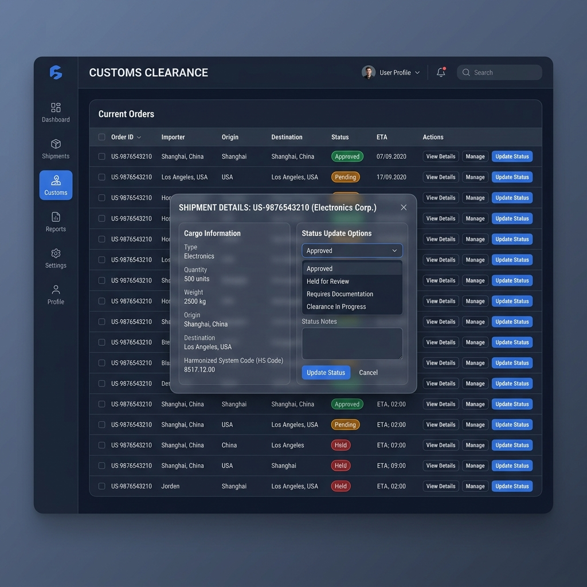

# ZENITH_LMS 운영 가이드: 관리자(Manager) 편

> **문서번호**: MAN-MGR-01
> **대상**: 시스템 관리자 및 경영진
> **최종 업데이트**: 2026-04-30

본 문서는 ZENITH_LMS 플랫폼의 최고 관리 권한(ZENITH_SUPER_ADMIN, ADMIN)을 가진 사용자를 위한 통합 운영 가이드입니다.

---

## 1. 로그인 및 대시보드 개요
시스템 접속 후 관리자 전용 대시보드를 통해 전사적 물류 지표를 실시간으로 모니터링할 수 있습니다.

- **접속 경로**: `https://zenith-lms.kr/admin` (자동 리다이렉트)
- **주요 지표**:
    - **오늘의 신규 오더**: 당일 접수된 하우스 오더 건수.
    - **통관 대기/진행 현황**: 즉각적인 조치가 필요한 CCL 신고 건수.
    - **미결제 인보이스**: 납기일이 경과한 정산 항목 요약.
    - **시스템 파라미터**: 현재 적용 중인 환율 및 주요 운영 변수.

## 2. 회원 관리 및 승인 거버넌스
플랫폼의 보안과 품질 유지를 위해 신규 가입 및 등급 승급 요청을 심사합니다.

### 2.1 법인 회원 가입 승인
1. 메뉴: `시스템 관리 > 회원 승인 관리` 이동.
2. 상태 필터에서 `PENDING` 항목 확인.
3. 대상 업체의 사업자 등록 정보 및 서류 검토.
4. `승인` 또는 `반려` 버튼 클릭 (반려 시 구체적 사유 입력 필수).

### 2.2 개인 회원 등급 승급 심사
1. 메뉴: `고객 지원 > 등급 승급 심사` 이동.
2. 화주의 활동 이력 및 누적 오더량을 기반으로 승급 적합성 판단.
3. `심사하기` 모달을 통해 승인 처리 시 즉시 화주의 등급(IRON → BRONZE 등)이 변경됩니다.

## 3. 오더 및 마스터 오더 관제
전체 오더의 흐름을 조망하고 효율적인 배송을 위해 마스터 오더를 구성합니다.

- **오더 통합 관제**: `오더 관리 > 통합 오더 현황`에서 전사적 오더 상태를 추적합니다.
- **마스터 오더 생성 (Packing)**:
    1. 동일 목적지/일정의 하우스 오더들을 선택합니다.
    2. `마스터 오더 생성` 버튼을 클릭하여 벌크 래핑 번호를 발급합니다.
    3. 창고 입고 대기 상태로 자동 전환됩니다.

## 4. 통관 관리 시스템 (CCL)
통관 프로세스를 관리하고 상태를 강제로 업데이트하거나 신고서를 제출합니다.

### 4.1 통관 신고 프로세스

1. 메뉴: `통관 관리 > 통관 신고 관리` 이동.
2. **신고 제출 (Submission)**:
    - `PENDING` 상태의 오더 옆의 **비행기 아이콘(Send)** 버튼을 클릭합니다.
    - 확인 팝업에서 승인 시 어댑터를 통해 관세청 시스템으로 데이터가 전송되며, 상태가 `SUBMITTED`로 변경됩니다.
3. **상태 모니터링 및 수동 갱신**:
    - **보기 아이콘(Eye)**을 클릭하여 상세 모달을 엽니다.
    - **처리 상태**: 관세청 결과에 따라 `APPROVED(승인)`, `HELD(보류)`, `REJECTED(반려)` 등으로 상태를 변경할 수 있습니다.
    - **신고번호 입력**: 제출 후 발급된 관세청 신고번호를 입력하여 관리합니다.
    - **관리자 메모**: 보류 또는 반려 시 사유를 입력하면 화주가 마이페이지에서 즉시 확인할 수 있습니다.

### 4.2 어댑터 관리 (기술 사항)
- 시스템은 **어댑터 패턴**을 사용하여 외부 연동을 처리합니다. 현재는 `ManualAdapter`가 기본 적용되어 있으며, 추후 관세청 API 연동 시에도 동일한 UI에서 조작이 가능합니다.

## 5. 재무 및 통계 관리
비즈니스 수익성을 분석하고 정산 정합성을 검증합니다.

- **인보이스 발행**: 오더 완료 후 `정산 관리` 메뉴에서 실시간 비용을 기반으로 청구서를 생성합니다.
- **수입/비용 리포트**: 기간별 매출 및 원가를 차트와 그리드로 확인합니다.
- **원가 관리**: 각 운송 구간별 기준 원가를 설정하여 자동 정산 엔진의 기초 데이터를 관리합니다.

## 6. 고객 지원 및 콘텐츠 관리
공지사항, FAQ, VOC를 통해 고객과 소통합니다.

- **VOC 답변**: `고객 지원 > 1:1 문의 관리`에서 화주의 오더 관련 문의에 답변합니다. `Quick Reply` 기능을 활용하여 표준 답변을 빠르게 전송할 수 있습니다.
- **시스템 공지**: 전체 사용자에게 발송될 중요 공지사항을 작성하고 게시 기간을 설정합니다.

## 7. 시스템 설정 및 거버넌스
시스템의 핵심 동작 파라미터와 요율 정책을 제어합니다.

- **기초 코드 관리**: 국가, 항구, 항공사 등 마스터 코드를 관리합니다.
- **요율 거버넌스 (TISA)**: 서비스별 기본 요율을 설정하고, 특정 시점의 요율 스냅샷을 생성하여 소급 적용 시 기준점으로 활용합니다.
- **운영 파라미터**: 부피 계수, 환율, 알림 임계값 등 시스템 전반에 영향을 주는 변수를 동적으로 수정합니다.

---
**FAQ: 권한 에러(403) 발생 시**
- 관리자 계정이 `profiles` 테이블에서 `ADMIN` 또는 `ZENITH_SUPER_ADMIN` 역할로 설정되어 있는지 데이터베이스 관리자에게 확인을 요청하십시오.
