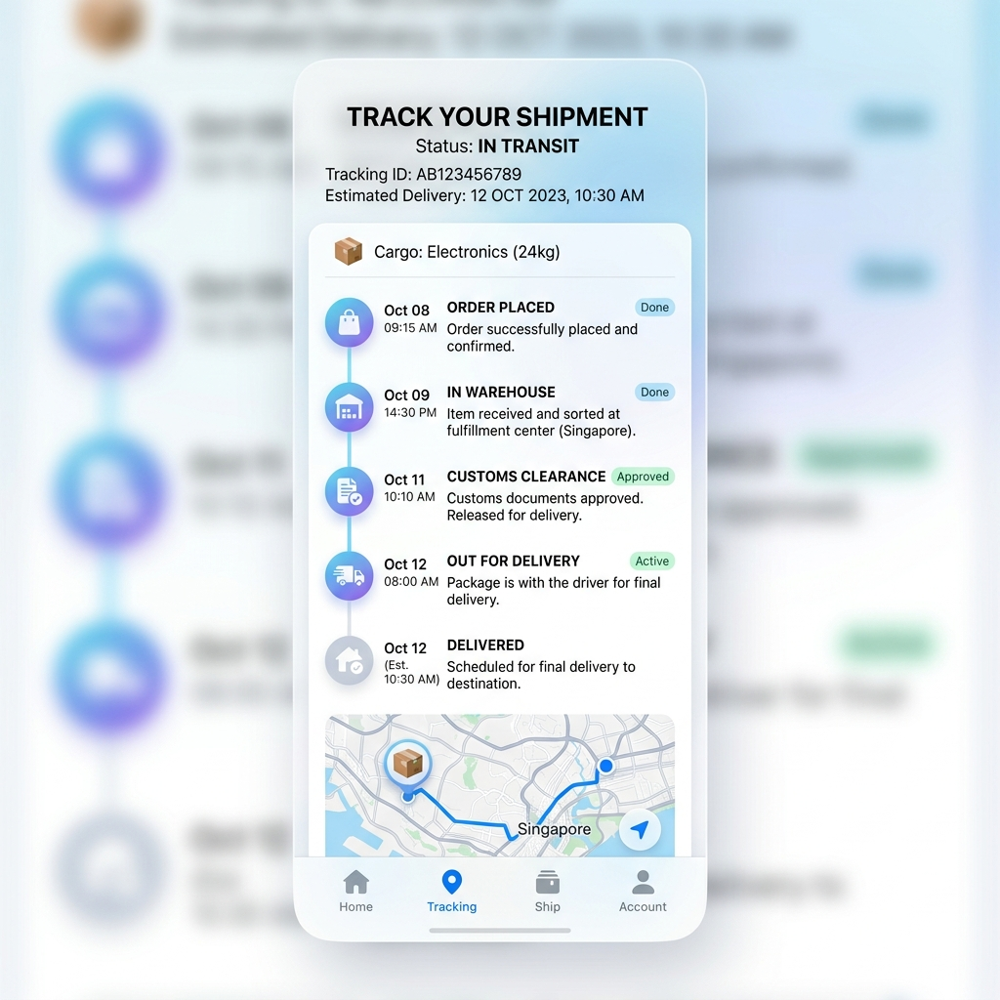

# ZENITH_LMS 서비스 이용 가이드: 화주(User) 편

> **문서번호**: MAN-USR-01
> **대상**: 일반 화주 (B2B 기업 및 B2C 개인)
> **최종 업데이트**: 2026-04-30

안녕하세요! ZENITH_LMS를 통해 빠르고 투명한 글로벌 물류 서비스를 경험해 보세요. 본 가이드는 화주님께서 서비스를 이용하시는 데 필요한 핵심 과정을 안내합니다.

---

## 1. 회원가입 및 이용 시작
1. **회원가입**: `https://zenith-lms.kr/join`에서 계정을 생성합니다. (기업/개인 구분 선택 필수)
2. **승인 대기**: 관리자의 검토 후 승인이 완료되면 모든 서비스를 이용하실 수 있습니다.
3. **등급 승급**: 이용 실적에 따라 등급이 상승하며, 더 높은 할인율과 우대 요율을 적용받으실 수 있습니다.

## 2. 오더 접수 (운송 의뢰)
화물을 보내기 위한 가장 첫 번째 단계입니다.

1. 메뉴: `오더 관리 > 신규 오더 접수` 이동.
2. **정보 입력**: 송하인(보내는 분), 수하인(받는 분) 정보를 입력합니다. (주소록 기능을 사용하면 더 빠릅니다.)
3. **화물 정보**: 화물의 종류, 무게, 부피를 입력합니다.
4. **예상 운임 확인**: 입력된 정보를 바탕으로 실시간 예상 운임(Estimated Cost)을 미리 확인해 볼 수 있습니다.
5. **접수 완료**: `오더 신청` 버튼을 누르면 관리자가 확인 후 배차를 시작합니다.

## 3. 실시간 배송 및 통관 현황 조회
내 화물이 어디쯤 있는지, 통관은 잘 진행되고 있는지 실시간으로 확인하세요.

- **통합 트래킹**: `마이페이지 > 트래킹 현황`에서 모든 오더의 현재 위치를 지도로 확인합니다.

- **오더 상세 타임라인**: 특정 오더를 클릭하면 출항, 입항, 통관, 배송 완료까지의 전 과정을 타임라인 형태로 상세히 볼 수 있습니다.
- **통관 현황 및 메모**: `마이페이지 > 통관 이력`에서 내 화물의 신고 상태를 확인하세요. 만약 보류(HELD) 상태인 경우, 담당자가 남긴 **관리자 메모**를 확인하여 필요한 서류를 보충하거나 조치를 취할 수 있습니다.

## 4. 자산 및 정산 관리
이용 금액을 정산하고 포인트 혜택을 누리세요.

- **포인트 및 선불 잔액**: `마이페이지 > 자산 관리`에서 현재 보유 중인 포인트와 선불 충전금 잔액을 확인합니다.
- **정산 내역**: 운송이 완료된 오더의 청구 내역을 확인하고, 발행된 세금계산서를 조회하거나 다운로드할 수 있습니다.

## 5. 고객 소통 및 사후 관리
서비스 이용 중 궁금한 점이나 문제가 발생하면 언제든 소통하세요.

- **1:1 문의 (VOC)**: 오더와 관련된 문의사항을 남기면 담당자가 실시간으로 답변해 드립니다.
- **오더 QnA**: 각 오더 상세 페이지 하단에서 담당자와 직접 대화하며 특이사항을 주고받을 수 있습니다.
- **클레임 신청**: 화물 파손이나 지연 시 클레임을 정식으로 접수하고 처리 과정을 모니터링할 수 있습니다.

---
**도움말: 알림 설정**
- 서비스 설정에서 이메일 또는 인앱 알림을 켜두시면, 통관 보류나 배송 완료와 같은 중요 이벤트를 실시간으로 받아보실 수 있습니다.
